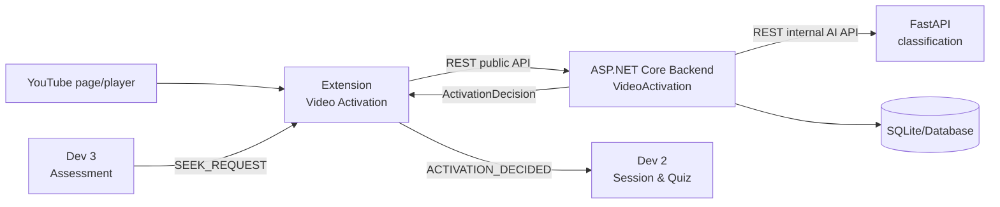

# StudyLens AI — Gói công việc Dev 1: Video Activation

> **Người sở hữu:** Dev 1  
> **Module:** Video Activation & Content Acquisition  
> **Contract prefix:** `video-activation`  
> **Mục đích:** File này được dùng trực tiếp để giao việc cho Dev 1/Codex. Mọi thay đổi phải tuân thủ đúng phạm vi và đường dẫn được quy định bên dưới.

## 1. Vai trò và mục tiêu

Dev 1 chịu trách nhiệm toàn bộ lát cắt chức năng từ lúc người dùng mở một video YouTube đến lúc StudyLens có đủ dữ liệu để quyết định bật hoặc không bật chế độ học tập.

Luồng Dev 1 sở hữu:

```text
YouTube page
   -> nhận diện video và player
   -> lấy metadata và transcript
   -> Manual ON/OFF hoặc yêu cầu phân loại Auto
   -> ASP.NET Backend áp dụng policy/threshold
   -> FastAPI AI phân loại nội dung
   -> phát ActivationDecision cho module Session/Quiz
```

Mục tiêu bàn giao:

- Nhận diện chính xác trang xem video và việc chuyển video trong YouTube SPA.
- Cung cấp một `PlayerPort` ổn định cho các module khác mà không để họ thao tác trực tiếp DOM YouTube.
- Thu nhận và chuẩn hóa transcript kèm timestamp.
- Hỗ trợ Manual ON/OFF; quyết định thủ công của người dùng luôn được ưu tiên.
- Hỗ trợ Auto classification an toàn; lỗi hoặc kết quả không chắc chắn không được tự kích hoạt.
- Lưu video, transcript, kết quả phân loại và thiết lập người dùng qua Backend.
- Không làm chậm, dừng hoặc phá hoạt động phát video khi Extension/Backend/AI gặp lỗi.

## 2. Phạm vi yêu cầu

### 2.1 Trong phạm vi

| Mã | Phạm vi triển khai của Dev 1 |
|---|---|
| FR-01 | Nhận diện ngữ cảnh video YouTube hợp lệ; lấy Video ID, URL, tiêu đề, thời lượng, timestamp hiện tại và trạng thái phát/tạm dừng. Dev 1 đồng thời chuẩn hóa các event player để Dev 2 tiêu thụ qua contract. |
| FR-02 | Gửi dữ liệu video khả dụng qua Backend tới AI Service để phân loại; nhận nhãn và confidence đã được kiểm tra. |
| FR-03 | Cung cấp Activation Mode Auto/Manual và áp dụng đúng quy tắc quyết định kích hoạt của từng chế độ. |
| FR-04 | Cho phép người dùng ON/OFF trực tiếp; thao tác thủ công luôn override quyết định tự động. |
| FR-05 | Thu nhận, chuẩn hóa, kiểm tra và gửi transcript snapshot có timestamp. |
| FR-15 liên quan | Settings gồm chế độ Auto/Manual, chu kỳ câu hỏi, loại câu hỏi và độ khó; cung cấp `PreferenceSnapshot` cho module khác. |
| FR-16 liên quan | Xử lý lỗi nhận diện video/player, transcript, Backend và AI classification trong phạm vi module này. |

Các mô tả trên là cách ánh xạ yêu cầu sang module triển khai. Nếu mã FR trong SRS được chỉnh sửa, phải cập nhật bảng truy vết nhưng không tự mở rộng phạm vi.

Traceability P0 giữa backlog và SRS:

| Backlog P0 | SRS bắt buộc |
|---|---|
| A01, A02 | FR-01 |
| A05 | FR-02 |
| A04, A06 | FR-03, FR-04 |
| A03 | FR-05 |

Các PR P0 phải ghi cả mã Axx và FR tương ứng; không được coi task hoàn thành nếu test chỉ chứng minh implementation mà chưa chứng minh hành vi FR trong bảng trên.

### 2.2 Ngoài phạm vi

Dev 1 **không** triển khai:

- Session lifecycle, active-study timer, playback span hoặc segment interval.
- Sinh quiz, sinh câu hỏi, lưu Quiz/Question.
- UI nhập câu trả lời, submit answer, grading hoặc giải thích kết quả.
- History, dashboard hoặc thống kê kết quả học.
- Authentication đầy đủ, thanh toán, flashcard, spaced repetition hoặc nền tảng ngoài YouTube.
- Gọi LLM trực tiếp từ Extension.
- Truy cập database từ Extension hoặc FastAPI AI Service.

Nếu task yêu cầu một nội dung ngoài danh sách sở hữu, Dev 1 dừng ở contract/interface và gửi yêu cầu cho đúng module owner.

## 3. Kiến trúc tổng thể và ranh giới module



Quy tắc kiến trúc bắt buộc:

1. Extension chỉ gọi ASP.NET Backend; không gọi Cloud LLM/vLLM trực tiếp.
2. ASP.NET Backend là nơi duy nhất truy cập database và là nơi áp dụng confidence threshold.
3. FastAPI chỉ nhận input, gọi model, kiểm tra output và trả kết quả; không lưu trạng thái người dùng.
4. Dev 2/Dev 3 không import service nội bộ của Dev 1; các module giao tiếp bằng contract/event ổn định.
5. Dev 3 gửi `SEEK_REQUEST`; chỉ `youtube-player-adapter.ts` của Dev 1 được điều khiển player.
6. Business rule không đặt trong React component, endpoint hoặc FastAPI router.

## 4. Các đường dẫn Dev 1 sở hữu

Dev 1 được tạo và sửa trong các vùng sau:

```text
apps/extension/src/platform/youtube/**
apps/extension/src/features/video-activation/**

services/api/src/StudyLens.Api/Features/VideoActivation/**
services/api/tests/VideoActivation.Tests/**

services/ai/app/features/classification/**

contracts/public-api/video-activation.yaml
contracts/ai-api/classification.yaml
contracts/extension-messages/video-activation.schema.json
contracts/examples/video-activation/**

tests/contract/video-activation/**
tests/e2e/video-activation/**
```

Mọi đường dẫn khác được xem là ngoài quyền sở hữu, trừ khi Integration Captain giao task bằng văn bản.

## 5. Cây thư mục và chức năng từng file

### 5.1 Chrome/Edge Extension

```text
apps/extension/src/
├─ platform/
│  └─ youtube/
│     ├─ youtube-detector.ts
│     ├─ youtube-player-adapter.ts
│     ├─ transcript-reader.ts
│     ├─ youtube-events.ts
│     ├─ youtube-types.ts
│     └─ __tests__/
│        ├─ youtube-detector.spec.ts
│        ├─ youtube-player-adapter.spec.ts
│        └─ transcript-reader.spec.ts
└─ features/
   └─ video-activation/
      ├─ api/
      │  └─ video-activation-api.ts
      ├─ components/
      │  ├─ ActivationStatus.tsx
      │  ├─ ActivationToggle.tsx
      │  └─ SettingsPanel.tsx
      ├─ state/
      │  ├─ activation-store.ts
      │  └─ activation-reducer.ts
      ├─ services/
      │  ├─ activation-manager.ts
      │  └─ transcript-service.ts
      ├─ models/
      │  └─ video-activation.types.ts
      ├─ index.ts
      └─ __tests__/
         ├─ activation-manager.spec.ts
         ├─ activation-reducer.spec.ts
         └─ settings-panel.spec.tsx
```

#### `platform/youtube/`

Đây là lớp adapter phụ thuộc YouTube/browser. Không đưa business rule Auto/Manual vào folder này.

| File/folder | Chức năng |
|---|---|
| `youtube-detector.ts` | Kiểm tra URL `/watch`, lấy `youtubeVideoId`, title, canonical URL, duration; phát hiện chuyển video trong YouTube SPA; trả `unsupported` thay vì ném lỗi khi không phải trang video. |
| `youtube-player-adapter.ts` | Cài đặt `PlayerPort`: `getCurrentTime`, `getDuration`, `isPlaying`, `play`, `pause`, `seek`; cô lập mọi thao tác với DOM/player. |
| `transcript-reader.ts` | Đọc transcript khả dụng, chuẩn hóa cue và timestamp, nhận diện các trạng thái `available`, `unavailable`, `insufficient`. Không sinh câu hỏi. |
| `youtube-events.ts` | Chuyển sự kiện đặc thù của YouTube thành event chuẩn: `PLAYER_PLAYING`, `PLAYER_PAUSED`, `PLAYER_BUFFERING`, `PLAYER_SEEKED`, `PLAYER_ENDED`, `VIDEO_CONTEXT_CHANGED`. |
| `youtube-types.ts` | Type/interface dành riêng cho adapter YouTube; không chứa DTO public API. |
| `__tests__/` | Unit test bằng fake DOM/player/transcript; không phụ thuộc mạng thật. |

`PlayerPort` tối thiểu:

```typescript
export interface PlayerPort {
  getCurrentTimeMs(): number | null;
  getDurationMs(): number | null;
  isPlaying(): boolean;
  play(): Promise<void>;
  pause(): Promise<void>;
  seek(timestampMs: number): Promise<void>;
}
```

Tất cả thời gian video dùng số nguyên millisecond. `seek()` phải validate `0 <= timestampMs <= durationMs` khi duration khả dụng.

#### `features/video-activation/api/`

| File | Chức năng |
|---|---|
| `video-activation-api.ts` | Client duy nhất của module để gọi Backend: classify, upload transcript, get/update settings. Chuẩn hóa timeout và error envelope; không đặt `fetch()` rải rác trong component. |

#### `features/video-activation/components/`

| File | Chức năng |
|---|---|
| `ActivationStatus.tsx` | Hiển thị `off`, `classifying`, `ready`, `active`, `unknown`, `error` và lý do thân thiện với người dùng. |
| `ActivationToggle.tsx` | Nút ON/OFF thủ công. Hành động người dùng tạo override rõ ràng và có ưu tiên cao hơn AI. |
| `SettingsPanel.tsx` | Đọc/cập nhật Auto/Manual, interval 5/10/15 phút, loại câu hỏi và độ khó. Chỉ gọi service/API; không tự lưu business state. |

#### `features/video-activation/state/`

| File | Chức năng |
|---|---|
| `activation-store.ts` | Lưu state hiện tại của UI: video context, mode, activation status, classification, transcript status, preferences và lỗi. |
| `activation-reducer.ts` | Pure state machine kiểm soát chuyển trạng thái; reject transition không hợp lệ và dễ unit test. |

State machine tham chiếu:

```text
OFF -> CLASSIFYING -> READY -> ACTIVE
          |            |
          v            v
       UNKNOWN       ERROR

User OFF: mọi trạng thái -> OFF
User ON : video hợp lệ -> ACTIVE
Video changed: reset quyết định cũ, bắt đầu context mới
```

#### `features/video-activation/services/`

| File | Chức năng |
|---|---|
| `activation-manager.ts` | Điều phối detector, transcript, settings, Manual/Auto policy và event bus. Manual không tự bật; Auto chỉ bật khi Backend trả quyết định đủ điều kiện. |
| `transcript-service.ts` | Map output từ `transcript-reader.ts` sang DTO contract, tính hash/idempotency metadata và upload snapshot qua API client. |

#### Các file còn lại

| File | Chức năng |
|---|---|
| `models/video-activation.types.ts` | Type nội bộ của feature; phân biệt rõ với generated contract types. |
| `index.ts` | Public surface duy nhất của module: export component, initializer và event handler cần thiết. Không export repository/helper nội bộ. |
| `__tests__/` | Test reducer, manager, UI và error flow bằng fake ports/fixtures. |

### 5.2 ASP.NET Core Backend

```text
services/api/src/StudyLens.Api/Features/VideoActivation/
├─ Api/
│  ├─ ClassifyVideoEndpoint.cs
│  ├─ CreateTranscriptSnapshotEndpoint.cs
│  ├─ GetSettingsEndpoint.cs
│  └─ UpdateSettingsEndpoint.cs
├─ Application/
│  ├─ Contracts/
│  │  ├─ ITranscriptSnapshotReader.cs
│  │  └─ TranscriptSnapshotForSession.cs
│  ├─ ClassifyVideo/
│  │  ├─ ClassifyVideoCommand.cs
│  │  ├─ ClassifyVideoHandler.cs
│  │  └─ ClassifyVideoValidator.cs
│  ├─ CreateTranscriptSnapshot/
│  │  ├─ CreateTranscriptSnapshotCommand.cs
│  │  ├─ CreateTranscriptSnapshotHandler.cs
│  │  └─ CreateTranscriptSnapshotValidator.cs
│  ├─ GetSettings/
│  │  ├─ GetSettingsQuery.cs
│  │  └─ GetSettingsHandler.cs
│  └─ UpdateSettings/
│     ├─ UpdateSettingsCommand.cs
│     ├─ UpdateSettingsHandler.cs
│     └─ UpdateSettingsValidator.cs
├─ Domain/
│  ├─ Video.cs
│  ├─ TranscriptSnapshot.cs
│  ├─ TranscriptCue.cs
│  ├─ LearningPreferences.cs
│  ├─ ClassificationResult.cs
│  └─ VideoActivationErrors.cs
├─ Infrastructure/
│  ├─ VideoRepository.cs
│  ├─ TranscriptRepository.cs
│  ├─ PreferencesRepository.cs
│  ├─ ClassificationRepository.cs
│  ├─ ClassificationAiClient.cs
│  ├─ TranscriptSnapshotReader.cs
│  └─ Configurations/
│     ├─ VideoConfiguration.cs
│     ├─ TranscriptSnapshotConfiguration.cs
│     ├─ LearningPreferencesConfiguration.cs
│     └─ ClassificationResultConfiguration.cs
└─ VideoActivationModule.cs
```

#### `Api/`

- Chuyển HTTP request thành command/query.
- Trả đúng status code và error envelope.
- Không gọi EF Core hoặc AI client trực tiếp.
- Không chứa threshold rule.

#### `Application/`

- Mỗi folder là một use case độc lập.
- Handler điều phối domain, repository và `ClassificationAiClient`.
- Validator kiểm tra DTO, độ dài, enum và timestamp trước khi vào domain.
- `ClassifyVideoHandler` áp dụng threshold/policy sau khi nhận kết quả AI; FastAPI không quyết định bật StudyLens.
- `Application/Contracts/ITranscriptSnapshotReader.cs` là application contract server-side duy nhất mà Dev 2 được dùng để đọc transcript cho một session; contract trả immutable DTO `TranscriptSnapshotForSession`, không trả EF entity và không export repository.

#### `Domain/`

| File | Chức năng |
|---|---|
| `Video.cs` | Aggregate cho video YouTube; giữ external ID, metadata chuẩn hóa và invariant cơ bản. |
| `TranscriptSnapshot.cs` | Phiên bản transcript bất biến; có hash/version, trạng thái và danh sách cue. |
| `TranscriptCue.cs` | Value/entity con gồm text, `startMs`, `endMs`; đảm bảo timestamp hợp lệ. |
| `LearningPreferences.cs` | Settings của một principal/installation: mode, interval, question type, difficulty. |
| `ClassificationResult.cs` | Kết quả phân loại: label, confidence, model/prompt version, thời điểm và lý do chuẩn hóa. |
| `VideoActivationErrors.cs` | Mã lỗi domain ổn định; không chứa HTTP-specific message. |

#### `Infrastructure/`

- Repository chỉ triển khai persistence cho entity Dev 1 sở hữu.
- EF configuration nằm trong module để `DbContext` có thể scan tự động.
- `ClassificationAiClient.cs` là adapter gọi FastAPI theo `contracts/ai-api/classification.yaml`; có timeout, correlation ID và parse/validation chặt.
- `TranscriptSnapshotReader.cs` triển khai `ITranscriptSnapshotReader`; chỉ trả dữ liệu cần cho session/segmentation qua `TranscriptSnapshotForSession`, không lộ `TranscriptRepository` cho Dev 2.
- Không đặt API key trong source hoặc Extension; secret chỉ đọc từ cấu hình server/environment.

#### `VideoActivationModule.cs`

Đăng ký dependency và endpoint của module qua một public method duy nhất, ví dụ:

```csharp
public static IServiceCollection AddVideoActivationModule(
    this IServiceCollection services,
    IConfiguration configuration);

public static IEndpointRouteBuilder MapVideoActivationEndpoints(
    this IEndpointRouteBuilder endpoints);
```

Dev 1 tạo file này nhưng không tự sửa `Program.cs`; Integration Captain thực hiện bước đăng ký vào host.

### 5.3 FastAPI AI Service

```text
services/ai/app/features/classification/
├─ router.py
├─ schemas.py
├─ service.py
├─ prompt.py
├─ output_validator.py
└─ tests/
   ├─ test_router.py
   ├─ test_service.py
   └─ test_output_validator.py
```

| File/folder | Chức năng |
|---|---|
| `router.py` | Khai báo endpoint internal classification; map lỗi sang response chuẩn. Không chứa prompt/business rule. |
| `schemas.py` | Pydantic request/response models bám đúng AI OpenAPI contract. |
| `service.py` | Chọn prompt, gọi `LlmProvider`, validate output, trả kết quả chuẩn hóa. |
| `prompt.py` | Prompt template có version; yêu cầu output JSON và chỉ sử dụng metadata/transcript đã cung cấp. |
| `output_validator.py` | Reject label ngoài enum, confidence ngoài `[0,1]`, JSON lỗi hoặc output thiếu trường. |
| `tests/` | Dùng fake provider; bao phủ educational, non-educational, unknown, timeout và malformed output. |

AI chỉ trả nhận định:

```text
educational | nonEducational | unknown
```

AI không trả lệnh bật/tắt. Backend mới tạo `ActivationDecision` sau khi áp dụng policy.

### 5.4 Contracts

```text
contracts/
├─ public-api/
│  └─ video-activation.yaml
├─ ai-api/
│  └─ classification.yaml
├─ extension-messages/
│  └─ video-activation.schema.json
└─ examples/
   └─ video-activation/
      ├─ classify-educational.request.json
      ├─ classify-educational.response.json
      ├─ classify-unknown.response.json
      ├─ transcript-valid-vi.request.json
      ├─ transcript-unavailable.request.json
      ├─ settings-default.response.json
      ├─ ai-timeout.error.json
      └─ invalid-output.error.json
```

| Path | Ý nghĩa |
|---|---|
| `public-api/video-activation.yaml` | Hợp đồng Extension ↔ ASP.NET Backend cho classify, transcript và settings. |
| `ai-api/classification.yaml` | Hợp đồng ASP.NET Backend ↔ FastAPI classification. Đây là internal API, không dùng trực tiếp bởi Extension. |
| `extension-messages/video-activation.schema.json` | Event/message giữa content script, service worker, side panel và các feature. |
| `examples/video-activation/` | Fixtures chuẩn để Dev 1 test và để Dev 2 phát triển trước khi pipeline thật hoàn tất. |

Quy ước contract:

- JSON dùng `camelCase`.
- Enum dùng string; không dùng magic number.
- ID là UUID hoặc opaque string.
- Video timestamp là integer millisecond.
- System timestamp là ISO-8601 UTC.
- Canonical extension contract version là string literal `0.1.0`.
- Mọi extension message dùng cùng envelope bắt buộc gồm `type`, `contractVersion`, `correlationId`, `tabId`, `youtubeVideoId`, `occurredAtUtc`, `payload`; không đặt system timestamp riêng trong payload.
- Mọi mutation có idempotency key.
- Error envelope: `code`, `status`, `message`, `traceId`, `retryable`.

### 5.5 Tests

```text
services/api/tests/VideoActivation.Tests/
├─ Domain/
├─ Application/
├─ Api/
└─ Infrastructure/

tests/contract/video-activation/
├─ public-api.contract.spec.*
├─ ai-api.contract.spec.*
└─ extension-messages.contract.spec.*

tests/e2e/video-activation/
├─ manual-activation.spec.*
├─ auto-activation.spec.*
├─ transcript-unavailable.spec.*
└─ backend-ai-failure.spec.*
```

- Unit test không gọi mạng thật hoặc YouTube thật.
- Integration test Backend dùng database cô lập và fake AI server.
- AI test dùng deterministic fake LLM.
- Contract test validate cả provider và consumer bằng cùng fixture.
- E2E xác nhận Extension không làm gián đoạn player khi lỗi.

## 6. Domain entities và data ownership

| Entity/data | Dev 1 sở hữu | Quy tắc chính |
|---|---:|---|
| `Video` | Có | `youtubeVideoId` duy nhất theo provider; metadata được chuẩn hóa. |
| `TranscriptSnapshot` | Có | Bất biến sau khi lưu; version/hash dùng để phân biệt lần thu nhận. |
| `TranscriptCue` | Có | Thuộc snapshot; `startMs >= 0`, `endMs > startMs`, text không rỗng sau normalize. |
| `LearningPreferences` | Có | Một bản cho principal/`installationId`; interval chỉ 5/10/15 phút. |
| `ClassificationResult` | Có | Lưu label, confidence, model/prompt version, input hash và thời điểm. |
| `ActivationDecision` | Có contract, không nhất thiết là bảng | Output policy để Dev 2 bắt đầu/dừng session. |
| `StudySession`, `PlaybackSpan`, `StudySegment` | Không | Dev 2 sở hữu. Dev 1 chỉ phát decision/context. |
| `Quiz`, `Question` | Không | Dev 2 sở hữu. |
| `AnswerAttempt`, `GradeResult`, history | Không | Dev 3 sở hữu. |

Quy tắc tham chiếu chéo:

- Module khác chỉ lưu ID/reference cần thiết, không lấy EF entity của Dev 1 làm dependency trực tiếp.
- Extension chia sẻ transcript qua `TranscriptSnapshotRef`; server-side Dev 2 đọc qua `ITranscriptSnapshotReader` và `TranscriptSnapshotForSession`. Không export repository hoặc EF entity.
- Settings được chia sẻ bằng immutable `PreferenceSnapshot` tại thời điểm bắt đầu session.
- Nếu chưa có hệ thống login, dùng `installationId` opaque do Extension tạo và lưu. Không dùng email hoặc dữ liệu cá nhân giả định.

## 7. Input/output contracts

Các JSON bên dưới minh họa field bắt buộc. OpenAPI/JSON Schema là nguồn sự thật máy đọc được.

### 7.1 Canonical extension message envelope

Mọi message giữa content script, service worker, Side Panel và các feature phải dùng đúng envelope version `0.1.0`:

```typescript
export interface ExtensionMessageEnvelope<TType extends string, TPayload> {
  type: TType;
  contractVersion: "0.1.0";
  correlationId: string;
  tabId: number;
  youtubeVideoId: string;
  occurredAtUtc: string;
  payload: TPayload;
}
```

Dev 1 publish các event canonical sau; không tạo alias hoặc tên gần giống:

```text
PLAYER_PLAYING
PLAYER_PAUSED
PLAYER_BUFFERING
PLAYER_SEEKED
PLAYER_ENDED
VIDEO_CONTEXT_CHANGED
ACTIVATION_DECIDED
ACTIVATION_STOPPED
```

`SEEK_REQUEST`, `SEEK_COMPLETED` và `SEEK_REJECTED` cũng dùng cùng envelope. `occurredAtUtc` là system timestamp ISO-8601 UTC của message; không lặp `decidedAtUtc`, `detectedAt` hoặc system timestamp tương đương trong `payload`.

### 7.2 Video context và player events

Ví dụ `VIDEO_CONTEXT_CHANGED`:

```json
{
  "type": "VIDEO_CONTEXT_CHANGED",
  "contractVersion": "0.1.0",
  "correlationId": "2a975882-5df6-4e81-9f6d-d99d324be10f",
  "tabId": 42,
  "youtubeVideoId": "abc123xyz",
  "occurredAtUtc": "2026-09-04T02:00:00Z",
  "payload": {
    "title": "Introduction to Linear Algebra",
    "canonicalUrl": "https://www.youtube.com/watch?v=abc123xyz",
    "durationMs": 720000,
    "currentTimeMs": 0,
    "playbackState": "paused"
  }
}
```

Payload chuẩn tối thiểu của player event:

| Event | Payload bắt buộc và trường liên quan |
|---|---|
| `PLAYER_PLAYING` | `currentTimeMs`; optional `durationMs` |
| `PLAYER_PAUSED` | `currentTimeMs`; optional `durationMs` |
| `PLAYER_BUFFERING` | `currentTimeMs`; optional `durationMs`, `bufferedUntilMs` |
| `PLAYER_SEEKED` | `currentTimeMs`; optional `previousTimeMs`, `durationMs` |
| `PLAYER_ENDED` | `currentTimeMs`; optional `durationMs` |
| `VIDEO_CONTEXT_CHANGED` | `currentTimeMs`, `title`, `canonicalUrl`; optional `durationMs`, `playbackState` |

`currentTimeMs` là integer không âm tại thời điểm event xảy ra. Dev 2 chỉ consume các tên event canonical trên; `PLAYER_SEEK_STARTED` và `PLAYER_SEEK_COMPLETED` không phải player event của contract này.

### 7.3 Upload transcript snapshot và `TranscriptSnapshotRef`

```json
{
  "idempotencyKey": "transcript:abc123xyz:sha256-value",
  "youtubeVideoId": "abc123xyz",
  "language": "vi",
  "source": "youtubeCaption",
  "contentHash": "sha256-value",
  "cues": [
    {
      "startMs": 1000,
      "endMs": 4200,
      "text": "Hôm nay chúng ta tìm hiểu về ma trận."
    }
  ]
}
```

Response và reference nhúng trong activation event dùng đúng shape `TranscriptSnapshotRef`:

```typescript
export interface TranscriptSnapshotRef {
  transcriptSnapshotId: string;
  youtubeVideoId: string;
  language: string;
  status: "available" | "unavailable" | "insufficient";
  contentHash?: string;
  version: string;
}
```

Ví dụ:

```json
{
  "transcriptSnapshotId": "5f26af4a-b681-44c4-8bb0-f1c50989f72c",
  "youtubeVideoId": "abc123xyz",
  "language": "vi",
  "status": "available",
  "contentHash": "sha256-value",
  "version": "1"
}
```

Dev 2 không import `TranscriptRepository`. Trên server, Dev 1 publish `ITranscriptSnapshotReader`, trả `TranscriptSnapshotForSession` bất biến theo `transcriptSnapshotId`; DTO này chứa identity/status/version và nội dung/cues cần cho segmentation, nhưng không chứa EF entity hoặc persistence concern.

Internal application contract tối thiểu:

```csharp
public interface ITranscriptSnapshotReader
{
    Task<TranscriptSnapshotForSession?> GetForSessionAsync(
        string transcriptSnapshotId,
        CancellationToken cancellationToken);
}

public sealed record TranscriptSnapshotForSession(
    string TranscriptSnapshotId,
    string YoutubeVideoId,
    string Language,
    TranscriptSnapshotStatus Status,
    string Version,
    string? ContentHash,
    IReadOnlyList<TranscriptCueForSession> Cues);

public sealed record TranscriptCueForSession(
    string TranscriptCueId,
    long StartMs,
    long EndMs,
    string Text);
```

`TranscriptSnapshotStatus` chỉ có `Available`, `Unavailable`, `Insufficient`; snapshot không `Available` phải trả `Cues` rỗng. Interface được đăng ký bởi `VideoActivationModule`, còn implementation/repository giữ internal trong module Dev 1.

### 7.4 Classify video qua public Backend API

```json
{
  "idempotencyKey": "classify:abc123xyz:sha256-value:model-policy-v1",
  "youtubeVideoId": "abc123xyz",
  "title": "Introduction to Linear Algebra",
  "description": "Course lesson",
  "transcriptSnapshotId": "5f26af4a-b681-44c4-8bb0-f1c50989f72c"
}
```

Response:

```json
{
  "classificationResultId": "82e0483e-5ef0-4720-b1ed-c25812fa10ad",
  "classification": "educational",
  "confidence": 0.91,
  "activationDecision": "activate",
  "decisionReason": "confidenceThresholdMet",
  "modelVersion": "provider-model-version",
  "evaluatedAt": "2026-09-04T02:01:00Z"
}
```

Giá trị hợp lệ:

```text
classification: educational | nonEducational | unknown
activationDecision: activate | doNotActivate | requireManualDecision
```

### 7.5 Backend gọi AI Service

AI request chỉ chứa dữ liệu cần thiết, ưu tiên excerpt/normalized text thay vì dữ liệu người dùng không liên quan:

```json
{
  "requestId": "2a975882-5df6-4e81-9f6d-d99d324be10f",
  "title": "Introduction to Linear Algebra",
  "description": "Course lesson",
  "transcriptText": "Hôm nay chúng ta tìm hiểu về ma trận...",
  "language": "vi"
}
```

AI response:

```json
{
  "classification": "educational",
  "confidence": 0.91,
  "reasonCode": "instructionalContent",
  "modelVersion": "provider-model-version",
  "promptVersion": "classification-v1"
}
```

`reasonCode` là code ổn định, không yêu cầu lưu toàn bộ chain-of-thought hoặc giải thích nội bộ của model.

### 7.6 Settings và `PreferenceSnapshot`

```json
{
  "mode": "auto",
  "quizIntervalMinutes": 10,
  "questionType": "multipleChoice",
  "difficulty": "medium"
}
```

Enum:

```text
mode: auto | manual
questionType: multipleChoice | shortAnswer
difficulty: easy | medium | hard
quizIntervalMinutes: 5 | 10 | 15
```

Confidence threshold là policy phía Backend, không phải trường cấu hình người dùng và không được đưa xuống Extension.

`PreferenceSnapshot` chuyển cho Dev 2 chỉ có ba field sau; `mode` và confidence threshold không thuộc snapshot này:

```typescript
export interface PreferenceSnapshot {
  quizIntervalMinutes: 5 | 10 | 15;
  questionType: "multipleChoice" | "shortAnswer";
  difficulty: "easy" | "medium" | "hard";
}
```

Confidence threshold luôn là policy server-side, không xuất trong Settings contract, `PreferenceSnapshot` hoặc extension message.

### 7.7 Events xuất cho Dev 2

#### `ACTIVATION_DECIDED`

```json
{
  "type": "ACTIVATION_DECIDED",
  "contractVersion": "0.1.0",
  "correlationId": "2a975882-5df6-4e81-9f6d-d99d324be10f",
  "tabId": 42,
  "youtubeVideoId": "abc123xyz",
  "occurredAtUtc": "2026-09-04T02:01:00Z",
  "payload": {
    "decisionId": "560b6354-ad17-48e7-98c6-b7bbdc0360bd",
    "state": "active",
    "source": "auto",
    "reasonCode": "confidenceThresholdMet",
    "classification": {
      "classificationResultId": "82e0483e-5ef0-4720-b1ed-c25812fa10ad",
      "label": "educational",
      "confidence": 0.91
    },
    "transcriptSnapshot": {
      "transcriptSnapshotId": "5f26af4a-b681-44c4-8bb0-f1c50989f72c",
      "youtubeVideoId": "abc123xyz",
      "language": "vi",
      "status": "available",
      "contentHash": "sha256-value",
      "version": "1"
    },
    "preferences": {
      "quizIntervalMinutes": 10,
      "questionType": "multipleChoice",
      "difficulty": "medium"
    }
  }
}
```

`ACTIVATION_DECIDED.payload` bắt buộc có `decisionId`, `state`, `source`, `reasonCode`, `preferences`; `state` chỉ nhận `active | inactive`, `source` chỉ nhận `auto | manual`. `classification` là optional và chỉ có `classificationResultId`, `label: educational | nonEducational | unknown`, `confidence`. `transcriptSnapshot` là optional và phải đúng `TranscriptSnapshotRef`. Thời điểm quyết định chỉ dùng envelope `occurredAtUtc`.

`ACTIVATION_STOPPED` được phát khi một context đang active thực sự dừng vì Manual OFF, video context đổi hoặc lifecycle kết thúc. `ACTIVATION_DECIDED` với `state=inactive` biểu diễn quyết định không bắt đầu; không dùng nó thay cho stop event của một session đã active.

Dev 1 không publish `TRANSCRIPT_AVAILABLE`. Extension truyền optional `transcriptSnapshot` trong `ACTIVATION_DECIDED`; Backend của Dev 2 đọc nội dung qua `ITranscriptSnapshotReader`.

### 7.8 Event nhận từ Dev 3

#### `SEEK_REQUEST`

```json
{
  "type": "SEEK_REQUEST",
  "contractVersion": "0.1.0",
  "correlationId": "3d5cc412-08df-4b7e-a6db-bbbdd78190f8",
  "tabId": 42,
  "youtubeVideoId": "abc123xyz",
  "occurredAtUtc": "2026-09-04T02:04:00Z",
  "payload": {
    "timestampMs": 125000
  }
}
```

Dev 1 phải:

1. Xác nhận tab và video ID vẫn khớp.
2. Validate timestamp.
3. Gọi `PlayerPort.seek()`.
4. Phát `SEEK_COMPLETED` hoặc `SEEK_REJECTED` với error code; không ném lỗi làm hỏng UI.

### 7.9 Error envelope

```json
{
  "code": "AI_CLASSIFICATION_TIMEOUT",
  "status": 503,
  "message": "Không thể phân loại video lúc này.",
  "traceId": "00-a1b2c3",
  "retryable": true
}
```

Mã lỗi tối thiểu:

```text
VIDEO_CONTEXT_UNSUPPORTED
PLAYER_UNAVAILABLE
TRANSCRIPT_UNAVAILABLE
TRANSCRIPT_INSUFFICIENT
BACKEND_UNAVAILABLE
AI_CLASSIFICATION_TIMEOUT
AI_CLASSIFICATION_INVALID_OUTPUT
CLASSIFICATION_UNKNOWN
SETTINGS_INVALID
SEEK_INVALID_TIMESTAMP
SEEK_VIDEO_MISMATCH
```

## 8. Backlog tuần tự A01–A09

Mỗi task phải tạo một lát cắt có thể test. Không nhận nhiều task lớn trong cùng một PR.

### A01 — YouTube video context detector

**Traceability P0:** A01 → FR-01.

**Phụ thuộc:** Extension shell tồn tại; contract message version `0.1.0` được thống nhất.

**Đường dẫn chính:**

```text
apps/extension/src/platform/youtube/youtube-detector.ts
apps/extension/src/platform/youtube/youtube-types.ts
apps/extension/src/platform/youtube/__tests__/youtube-detector.spec.ts
contracts/extension-messages/video-activation.schema.json
```

**Deliverable:** Detector nhận diện `/watch`, lấy video ID/metadata và phát `VIDEO_CONTEXT_CHANGED` khi context thực sự đổi.

**Acceptance criteria:**

- URL hợp lệ trả đúng video ID.
- Trang home/search/shorts không bị xem là video hỗ trợ nếu MVP chỉ hỗ trợ `/watch`.
- Điều hướng SPA từ video A sang B phát đúng một context mới và không giữ state cũ.
- Metadata thiếu không gây crash; trường bắt buộc được báo bằng typed result.
- Không dùng polling dày làm ảnh hưởng hiệu năng trang.

**Tests:** URL matrix, SPA navigation, metadata trễ, DOM thiếu, duplicate event suppression.

### A02 — PlayerPort và normalized YouTube events

**Traceability P0:** A02 → FR-01.

**Phụ thuộc:** A01.

**Đường dẫn chính:**

```text
apps/extension/src/platform/youtube/youtube-player-adapter.ts
apps/extension/src/platform/youtube/youtube-events.ts
apps/extension/src/platform/youtube/__tests__/youtube-player-adapter.spec.ts
```

**Deliverable:** `PlayerPort` và event source chuẩn cho Dev 2/Dev 3.

**Acceptance criteria:**

- Đọc current time/duration theo millisecond.
- Phát đúng `PLAYER_PLAYING`, `PLAYER_PAUSED`, `PLAYER_BUFFERING`, `PLAYER_SEEKED`, `PLAYER_ENDED`, `VIDEO_CONTEXT_CHANGED`; mỗi payload có `currentTimeMs` và các trường liên quan theo mục 7.2.
- `seek()` reject timestamp âm, vượt duration hoặc sai video context.
- Player không tồn tại trả lỗi typed, không truy cập thuộc tính `undefined`.
- Listener được cleanup khi video/tab thay đổi; không phát event trùng.

**Tests:** fake player, missing player, seek boundaries, event ordering, cleanup/remount.

### A03 — Transcript acquisition và normalization

**Traceability P0:** A03 → FR-05.

**Phụ thuộc:** A01; có thể dùng fake context trước khi A02 xong.

**Đường dẫn chính:**

```text
apps/extension/src/platform/youtube/transcript-reader.ts
apps/extension/src/features/video-activation/services/transcript-service.ts
contracts/public-api/video-activation.yaml
contracts/examples/video-activation/transcript-*.json
```

**Deliverable:** `TranscriptSnapshot` hợp lệ hoặc trạng thái lỗi phân biệt rõ.

**Acceptance criteria:**

- Cue được trim text, sắp xếp theo `startMs`, có `endMs > startMs`.
- Bỏ cue trống; reject dữ liệu không còn đủ nội dung sau normalize.
- Tạo `contentHash` ổn định cho cùng một transcript.
- Retry upload cùng `idempotencyKey` không tạo snapshot trùng.
- `unavailable` và `insufficient` là hai trạng thái khác nhau.
- Không có transcript hợp lệ thì `TranscriptSnapshotRef.status` phải là `unavailable` hoặc `insufficient`, và `ACTIVATION_DECIDED` không được gắn snapshot như `available`.
- Backend publish `ITranscriptSnapshotReader` trả `TranscriptSnapshotForSession`; Dev 2 đọc qua application contract này, không import repository/EF entity.

**Tests:** transcript Việt/Anh, cue trùng/ngoài thứ tự, cue rỗng, không có transcript, transcript quá ngắn, retry.

### A04 — Manual activation và state machine

**Traceability P0:** A04 → FR-03, FR-04.

**Phụ thuộc:** A01, A02; sử dụng transcript fixture của A03 nếu A03 chưa merge.

**Đường dẫn chính:**

```text
apps/extension/src/features/video-activation/components/ActivationStatus.tsx
apps/extension/src/features/video-activation/components/ActivationToggle.tsx
apps/extension/src/features/video-activation/state/**
apps/extension/src/features/video-activation/services/activation-manager.ts
```

**Deliverable:** Manual ON/OFF hoạt động không cần AI.

**Acceptance criteria:**

- `mode=manual` không bao giờ tự ON.
- User ON cho video hợp lệ tạo `ACTIVATION_DECIDED` với `payload.state=active`, `payload.source=manual` và envelope đầy đủ.
- User OFF từ mọi trạng thái đưa module về OFF; nếu context đang active thì phát `ACTIVATION_STOPPED` để Dev 2 dừng/complete session.
- Chuyển video không tái sử dụng override của video trước nếu contract không quy định lưu override.
- Không transcript: có thể hiển thị active theo thao tác người dùng nhưng phải báo rõ quiz không thể sinh; không giả lập transcript.

**Tests:** reducer transition table, repeated toggle, video change, no transcript, component accessibility.

### A05 — Classification pipeline Extension → Backend → AI

**Traceability P0:** A05 → FR-02.

**Phụ thuộc:** A01, A03 và contract AI classification; A04 cung cấp UI state.

**Đường dẫn chính:**

```text
apps/extension/src/features/video-activation/api/video-activation-api.ts
services/api/src/StudyLens.Api/Features/VideoActivation/Api/ClassifyVideoEndpoint.cs
services/api/src/StudyLens.Api/Features/VideoActivation/Application/ClassifyVideo/**
services/api/src/StudyLens.Api/Features/VideoActivation/Infrastructure/ClassificationAiClient.cs
services/ai/app/features/classification/**
contracts/ai-api/classification.yaml
```

**Deliverable:** Pipeline phân loại có schema cố định, timeout và validation.

**Acceptance criteria:**

- Extension không có LLM API key và không gọi AI Service trực tiếp.
- FastAPI trả đúng enum/confidence; malformed model output bị reject.
- Backend áp dụng threshold và tạo `ActivationDecision`.
- `unknown`, timeout hoặc invalid output trả `requireManualDecision`; không tự ON.
- Correlation/trace ID đi xuyên suốt ba tầng.
- Không log nguyên transcript hoặc secret ở mức production mặc định.

**Tests:** educational/nonEducational/unknown, confidence ngay dưới/trên threshold, AI timeout, malformed JSON, duplicate request.

### A06 — Auto activation và user override

**Traceability P0:** A06 → FR-03, FR-04.

**Phụ thuộc:** A04, A05.

**Đường dẫn chính:**

```text
apps/extension/src/features/video-activation/services/activation-manager.ts
apps/extension/src/features/video-activation/state/**
apps/extension/src/features/video-activation/components/ActivationStatus.tsx
```

**Deliverable:** Auto flow hoàn chỉnh và an toàn khi lỗi.

**Acceptance criteria:**

- Auto chỉ ON khi Backend cho phép kích hoạt và Extension phát `ACTIVATION_DECIDED.payload.state=active` cho đúng video/correlation context.
- Response đến trễ của video A không được bật video B.
- User OFF sau Auto luôn thắng; classification retry không tự bật lại trái ý người dùng trong cùng context.
- `nonEducational` giữ OFF; `unknown` yêu cầu quyết định thủ công.
- Backend/AI lỗi chỉ làm module hiển thị lỗi, không pause/dừng video.

**Tests:** race video A/B, user override during request, stale response, retry, unmount/remount.

### A07 — Learning settings và PreferenceSnapshot

**Phụ thuộc:** A04, A06; settings contract đã review với Dev 2.

**Đường dẫn chính:**

```text
apps/extension/src/features/video-activation/components/SettingsPanel.tsx
services/api/src/StudyLens.Api/Features/VideoActivation/Api/GetSettingsEndpoint.cs
services/api/src/StudyLens.Api/Features/VideoActivation/Api/UpdateSettingsEndpoint.cs
services/api/src/StudyLens.Api/Features/VideoActivation/Application/GetSettings/**
services/api/src/StudyLens.Api/Features/VideoActivation/Application/UpdateSettings/**
```

**Deliverable:** Settings đọc/lưu được và tạo snapshot bất biến cho Dev 2.

**Acceptance criteria:**

- Default: Auto, 10 phút, Multiple Choice; độ khó theo quyết định chung của dự án.
- Backend reject interval ngoài 5/10/15 và enum không hợp lệ.
- UI thể hiện loading/saving/error và không mất giá trị cũ khi save thất bại.
- Session đã bắt đầu dùng snapshot cũ; đổi settings chỉ áp dụng cho session tiếp theo.
- Contract không buộc Dev 2 truy cập repository của Dev 1.

**Tests:** default settings, validation matrix, save failure, concurrent update policy, snapshot immutability.

### A08 — Persistence cho Video Activation

**Phụ thuộc:** A03, A05, A07.

**Đường dẫn chính:**

```text
services/api/src/StudyLens.Api/Features/VideoActivation/Domain/**
services/api/src/StudyLens.Api/Features/VideoActivation/Infrastructure/**
services/api/tests/VideoActivation.Tests/**
```

**Deliverable:** Entity, repository và EF configurations đầy đủ cho data Dev 1 sở hữu.

**Acceptance criteria:**

- Unique constraint phù hợp cho provider + `youtubeVideoId`.
- Transcript snapshot bất biến và idempotent theo video + content hash.
- Classification result truy vết được input/model/prompt version.
- Preferences được lấy theo principal/installation ID.
- Repository không trả EF entity ra module khác.
- Dev 1 không tự tạo/chỉnh EF migration snapshot; gửi migration request cho Integration Captain.

**Tests:** repository integration, uniqueness, idempotency, transaction rollback, concurrent insert, mapping round-trip.

### A09 — Hardening, contract test và browser E2E

**Phụ thuộc:** A01–A08.

**Đường dẫn chính:**

```text
tests/contract/video-activation/**
tests/e2e/video-activation/**
services/api/tests/VideoActivation.Tests/**
services/ai/app/features/classification/tests/**
```

**Deliverable:** Module sẵn sàng tích hợp với Dev 2/Dev 3 và fault matrix được chứng minh.

**Acceptance criteria:**

- Happy path Manual và Auto chạy end-to-end.
- Không transcript, transcript thiếu, Backend offline, AI timeout và AI invalid output đều có UI state đúng.
- YouTube player tiếp tục hoạt động khi StudyLens lỗi.
- `SEEK_REQUEST` đúng thực hiện seek; sai video/timestamp bị reject an toàn.
- Contract provider/consumer cùng pass trên fixtures version `0.1.0`.
- Smoke test trên Chrome và Edge.
- Không lộ secret trong bundle, log hoặc repository.

**Tests:** full fault matrix, accessibility cơ bản, cleanup/leak test, Chrome/Edge smoke, contract compatibility.

## 9. Mock và fixture để phát triển độc lập

Dev 1 không chờ module khác hoàn thành. Tạo ports/fakes sau:

| Mock/fixture | Mục đích |
|---|---|
| `FakeYouTubeDetector` | Giả lập video A/B, SPA navigation và trang không hỗ trợ. |
| `FakePlayerPort` | Giả lập play/pause/buffering/seek mà không mở YouTube thật. |
| `FakeTranscriptReader` | Trả transcript hợp lệ, unavailable, insufficient hoặc lỗi. |
| `FakeVideoActivationApi` | Test Extension khi Backend chưa chạy. |
| Fake AI HTTP server | Test Backend cho educational/nonEducational/unknown/timeout/malformed. |
| Deterministic `LlmProvider` | Test FastAPI không tốn token, không phụ thuộc mạng. |
| `ActivationDecision` fixtures | Cho Dev 2 phát triển session trước khi Dev 1 hoàn tất. |
| `SEEK_REQUEST` fixtures | Cho Dev 1 và Dev 3 contract-test độc lập. |

Fixture bắt buộc trong `contracts/examples/video-activation/`:

```text
video-valid.json
video-unsupported.json
transcript-valid-vi.json
transcript-valid-en.json
transcript-unavailable.json
transcript-insufficient.json
classification-educational.json
classification-non-educational.json
classification-unknown.json
classification-timeout.json
classification-invalid-output.json
settings-default.json
activation-manual-on.json
activation-auto-on.json
seek-request-valid.json
seek-request-video-mismatch.json
```

Fixtures phải:

- Không chứa dữ liệu cá nhân hoặc secret.
- Có giá trị deterministic.
- Validate được bằng contract schema.
- Được consumer Dev 2/Dev 3 dùng mà không import code Dev 1.

## 10. File HOT và file không được tự ý sửa

Dev 1 **không tự sửa** các file/folder sau:

```text
apps/extension/manifest.json
apps/extension/vite.config.ts
apps/extension/src/shell/App.tsx
apps/extension/src/shell/feature-registry.ts
apps/extension/src/shell/app-store.ts
apps/extension/src/generated/**

services/api/src/StudyLens.Api/Program.cs
services/api/src/StudyLens.Api/BuildingBlocks/**
services/api/src/StudyLens.Api/Infrastructure/Persistence/StudyLensDbContext.cs
services/api/src/StudyLens.Api/Infrastructure/Persistence/Migrations/**

services/ai/app/main.py
services/ai/app/platform/llm/**

contracts/public-api/root.yaml
contracts/ai-api/root.yaml

deploy/**
.github/workflows/**
pnpm-lock.yaml
package-lock.json
AGENTS.md
README.md
```

Đây là file `[HOT]` hoặc generated/shared. Nếu cần tích hợp:

1. Dev 1 hoàn thiện public module entry point/router.
2. Ghi rõ snippet/registration cần thêm trong PR description.
3. Integration Captain sửa HOT file bằng PR/commit nhỏ.
4. Ít nhất một dev khác review contract hoặc host registration.

Không sửa generated client bằng tay. Khi OpenAPI đổi, dùng generator chuẩn của repo qua Integration Captain nếu output nằm ngoài allowed paths.

## 11. Quy tắc Git, PR và phối hợp Codex

### 11.1 Branch và kích thước PR

Tên branch:

```text
feat/d1-a01-video-detector
feat/d1-a03-transcript-acquisition
fix/d1-stale-classification-response
test/d1-video-activation-contract
```

Quy tắc:

- Một task Axx chính cho mỗi branch/PR.
- Mỗi PR nên kéo dài 0,5–2 ngày và merge khi test xanh.
- Không tạo branch dài hạn `frontend`, `backend` hoặc `ai`.
- Rebase/merge `main` thường xuyên theo quy ước nhóm; không force-push lên branch của người khác.
- Không đưa refactor không liên quan vào PR feature.

### 11.2 PR description bắt buộc

```markdown
## Task
A0X - <tên task>

## FR coverage
- FR-0X
- FR-15/FR-16 (nếu liên quan)

## Allowed paths changed
- <liệt kê>

## Contract impact
- Contract version: 0.1.0
- Breaking change: No
- Fixtures added/updated: <liệt kê>

## Behavior delivered
- <hành vi quan sát được>

## Tests executed
- <lệnh> — PASS/FAIL

## HOT-file integration request
- None hoặc <registration/migration cần Integration Captain thực hiện>

## Risks / handoff notes
- <ghi chú cho Dev 2/Dev 3>
```

### 11.3 Contract-change protocol

- Contract thay đổi phải cập nhật schema, fixture và contract test trong cùng PR.
- Breaking change cần tăng contract version và có review của consumer.
- Event cho Dev 2 cần Dev 2 review; `SEEK_REQUEST` cần Dev 3 review.
- Không đổi tên/xóa field consumer đang dùng mà không có migration/deprecation plan.
- Không dùng type nội bộ thay cho DTO public.

### 11.4 Prompt chuẩn giao cho Codex Dev 1

```text
Bạn là Dev 1 của StudyLens, sở hữu module Video Activation.

Task: A0X - <mục tiêu cụ thể>
FR liên quan: <FR-01..FR-05, FR-15 hoặc FR-16>
Contract version: 0.1.0

Allowed paths:
- apps/extension/src/platform/youtube/**
- apps/extension/src/features/video-activation/**
- services/api/src/StudyLens.Api/Features/VideoActivation/**
- services/api/tests/VideoActivation.Tests/**
- services/ai/app/features/classification/**
- contracts/*/<các file video-activation được giao>
- tests/contract/video-activation/**
- tests/e2e/video-activation/**

Do not modify:
- manifest.json, App.tsx, feature-registry.ts
- Program.cs, StudyLensDbContext.cs, Migrations/**
- main.py, platform/llm/**
- root.yaml, generated/**, lockfiles, CI, deploy/**
- module SessionQuiz hoặc AssessmentHistory

Acceptance criteria:
- <copy nguyên tiêu chí của task A0X>

Required tests:
- <unit/integration/contract/e2e cần chạy>

Implementation rules:
- Extension không gọi AI trực tiếp.
- Backend áp dụng threshold và là nơi duy nhất truy cập database.
- AI Service stateless.
- Giao tiếp chéo module chỉ qua contract/event.
- Không làm gián đoạn YouTube player khi có lỗi.

Trước khi code: đọc các file trong allowed paths và báo nếu checkout khác kiến trúc.
Sau khi code: chạy test, tóm tắt file thay đổi, kết quả test và HOT-file integration request.
```

### 11.5 Lệnh kiểm tra đề xuất

Dùng chính xác script được repo khai báo trong `AGENTS.md`/README. Nếu project dùng các tên lệnh dưới đây, phạm vi tối thiểu là:

```powershell
pnpm --filter extension test -- video-activation
dotnet test services/api/tests/VideoActivation.Tests
python -m pytest services/ai/app/features/classification/tests
pnpm test:contract --filter video-activation
pnpm test:e2e --filter video-activation
```

Không tự cài package, đổi lockfile hoặc đổi test runner nếu chưa được giao.

## 12. Quality, security và observability

### Quality

- TypeScript bật strict mode; tránh `any` ở contract boundary.
- C# nullable enabled; dùng domain/result type thay vì exception cho lỗi dự kiến.
- Pydantic reject extra/invalid fields theo policy contract.
- Mọi async request có timeout/cancellation.
- Stale response phải bị bỏ qua bằng video ID + correlation/context version.

### Security/privacy

- Không hard-code API key, token hoặc connection string.
- Extension bundle không chứa LLM credentials.
- Validate toàn bộ dữ liệu từ DOM, Extension và AI.
- Không render transcript/model text bằng HTML không sanitize.
- Không log transcript toàn văn theo mặc định; log ID/hash/length đủ để truy vết.
- Chỉ gửi AI dữ liệu tối thiểu cần cho classification.

### Observability

Tối thiểu cần có structured log/telemetry cho:

```text
video_context_detected
transcript_acquisition_completed
classification_requested
classification_completed
classification_failed
activation_decided
user_override_applied
seek_completed / seek_rejected
```

Log phải có `traceId`/`correlationId`, `youtubeVideoId` đã cân nhắc privacy, duration và error code; không ghi secret.

## 13. Definition of Done của Dev 1

Một task chỉ được coi là hoàn thành khi:

- [ ] Chỉ sửa allowed paths hoặc có commit riêng của Integration Captain cho HOT file.
- [ ] Hành vi đáp ứng acceptance criteria của task Axx.
- [ ] Contract/schema và fixture liên quan đã cập nhật, validate thành công.
- [ ] Unit tests cho Extension/Backend/AI liên quan đều pass.
- [ ] Integration/contract test liên quan pass.
- [ ] Không có API key/secret trong Extension hoặc repository.
- [ ] Manual mode không tự kích hoạt.
- [ ] User override luôn thắng quyết định Auto.
- [ ] Auto chỉ bật khi Backend trả quyết định hợp lệ cho đúng video context.
- [ ] Không có transcript hợp lệ thì không gắn snapshot `available` cho quiz pipeline.
- [ ] Backend/AI lỗi không pause, dừng hoặc phá YouTube player.
- [ ] Retry mutation không tạo dữ liệu trùng.
- [ ] Loading/error/unknown state hiển thị rõ và có thể phục hồi.
- [ ] Public surface không export implementation nội bộ.
- [ ] PR mô tả test đã chạy và mọi HOT-file integration request.
- [ ] Consumer Dev 2/Dev 3 có fixture mới nhất để phát triển độc lập.

## 14. Checklist bàn giao module

### Bàn giao cho Dev 2

- [ ] `ACTIVATION_DECIDED` schema version `0.1.0` đã merge và dùng đầy đủ canonical envelope.
- [ ] `ActivationDecision` fixtures gồm Manual ON/OFF, Auto ON, nonEducational, unknown.
- [ ] `TranscriptSnapshotRef` và trạng thái unavailable/insufficient đã mô tả.
- [ ] `PreferenceSnapshot` chỉ có `quizIntervalMinutes`, `questionType`, `difficulty`; không có threshold.
- [ ] Normalized player event contract đã chốt.
- [ ] `ITranscriptSnapshotReader`/`TranscriptSnapshotForSession` đã đăng ký server-side; Dev 2 không import repository của Dev 1.
- [ ] Dev 2 không cần import `activation-manager.ts` hoặc repository Dev 1.

### Bàn giao cho Dev 3

- [ ] `SEEK_REQUEST`, `SEEK_COMPLETED`, `SEEK_REJECTED` schema đã merge.
- [ ] Fixture timestamp hợp lệ, vượt duration và video mismatch đã có.
- [ ] `youtube-player-adapter.ts` là nơi duy nhất thực hiện seek.
- [ ] Error từ seek không làm mất state câu trả lời của Dev 3.

### Bàn giao cho Integration Captain

- [ ] Có snippet đăng ký `VideoActivationModule` vào ASP.NET host.
- [ ] Có snippet đăng ký classification router vào FastAPI host.
- [ ] Có snippet đăng ký Extension feature/event listener vào shell.
- [ ] Danh sách EF configurations/entity cần migration đã cung cấp.
- [ ] Không tự sửa migration snapshot, root OpenAPI, manifest, lockfile hoặc CI.
- [ ] Full test command và kết quả đã ghi trong PR.

## 15. Tiêu chí hoàn thành cuối cùng của module

Module Video Activation được xem là sẵn sàng ghép khi một người dùng có thể:

1. Mở một video YouTube hợp lệ.
2. Extension nhận diện đúng video và lấy được player context.
3. Bật StudyLens thủ công, hoặc để Auto phân loại qua Backend/AI.
4. Nhìn thấy trạng thái rõ ràng khi video educational, nonEducational, unknown hoặc có lỗi.
5. Có transcript snapshot hợp lệ được lưu và tham chiếu, hoặc nhận thông báo không có transcript.
6. Thay đổi settings và nhận `PreferenceSnapshot` ổn định cho phiên tiếp theo.
7. Phát `ACTIVATION_DECIDED` để Dev 2 bắt đầu session.
8. Nhận `SEEK_REQUEST` từ Dev 3 và điều khiển đúng video/timestamp.
9. Tiếp tục xem YouTube bình thường ngay cả khi Backend hoặc AI không khả dụng.

Nếu chín bước này chưa chạy được với fixture và test tương ứng, module chưa đủ điều kiện handoff.
