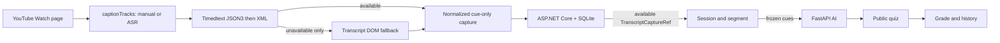

# StudyLens AI architecture

The persistent activation gate is learner-controlled. A valid YouTube caption
capture is the prerequisite for a session; it is not an AI classification
decision.

Extension owns browser and YouTube DOM code. Backend is the persistent system
of record and only it calls FastAPI. FastAPI owns stateless question generation
and short-answer grading. Version 0.4.0 removes all runtime audio/STT capture;
the only new transcript source is `youtubeCaption`.

The direct Timedtext route is the primary Full Text acquisition route: it
selects a YouTube manual or ASR track and reads timestamped cues from JSON3,
falling back to XML. DOM observation opens YouTube's “Transcript” panel only
when direct retrieval is unavailable, so it cannot replace or duplicate a
successful direct capture. Backend validates video identity, cue bounds,
canonical content hash and idempotency before storing cue-only data. Session
Quiz freezes a segment before Backend sends it to FastAPI; FastAPI never
acquires captions itself.

See [repository map](repository-map.md) and
[spec/source alignment](spec-source-alignment-v1.2.md).
