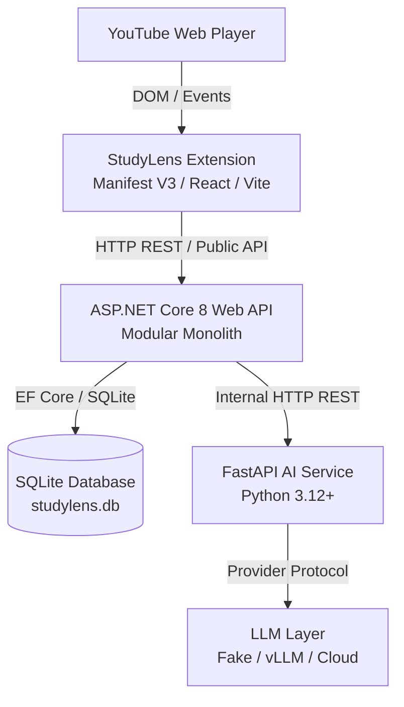

# StudyLens AI — System Architecture

## 1. Overview

**StudyLens AI** is an active learning companion for YouTube Web. It monitors video playback, extracts normalized transcript segments, and triggers timely AI-generated quizzes to enhance learning comprehension and retention.

---

## 2. Physical Architecture

### Architectural Principles

1. **Extension Isolation**:
   - Extension only communicates with the ASP.NET Core Backend.
   - Extension contains no direct AI/LLM API calls, no database connections, and no API keys.
   - YouTube playback is non-blocking: errors in StudyLens never interrupt YouTube video playback.

2. **Backend Authority**:
   - ASP.NET Core Backend owns all application state, sessions, persistence, and AI orchestration.
   - Database operations are restricted entirely to the Backend.

3. **Stateless AI Service**:
   - FastAPI is strictly stateless. It does not store user sessions or database state.
   - The AI service accepts structured payloads, constructs prompts, calls the LLM provider abstraction, validates outputs, and returns structured responses.

4. **Independent Vertical Ownership**:
   - The monorepo is divided into 3 vertical business modules (`Dev 1`, `Dev 2`, `Dev 3`).
   - Modules communicate across process boundaries using versioned contracts (`contracts/`).

---

## 3. Vertical Module Slicing

```mermaid
flowchart LR
    subgraph Dev1["Dev 1: Video Activation"]
        direction TB
        E1[apps/extension/.../video-activation]
        B1[services/api/.../Features/VideoActivation]
        A1[services/ai/.../features/classification]
    end

    subgraph Dev2["Dev 2: Session & Quiz"]
        direction TB
        E2[apps/extension/.../session-quiz]
        B2[services/api/.../Features/SessionQuiz]
        A2[services/ai/.../features/question_generation]
    end

    subgraph Dev3["Dev 3: Assessment & History"]
        direction TB
        E3[apps/extension/.../assessment-history]
        B3[services/api/.../Features/AssessmentHistory]
        A3[services/ai/.../features/grading]
    end

    Dev1 -->|ACTIVATION_DECIDED| Dev2
    Dev2 -->|QUIZ_AVAILABLE| Dev3
    Dev3 -->|SEEK_REQUEST| Dev1
```

- **Dev 1 (Video Activation)**: YouTube detection, PlayerPort, transcript acquisition, Manual ON/OFF, and Auto classification.
- **Dev 2 (Session & Quiz)**: StudySession lifecycle, active watch time tracking, transcript segmentation, and quiz generation orchestration.
- **Dev 3 (Assessment & History)**: Answer submission, MCQ/Short Answer grading, timestamp review, and learning history queries.

---

## 4. Cross-Module Seams

- **Dev 1 → Dev 2**: `ACTIVATION_DECIDED` event and `TranscriptSnapshotForSession`. Dev 2 does not read YouTube DOM or raw transcript sources directly.
- **Dev 2 → Dev 3**: `QUIZ_AVAILABLE` event and `QuestionForAssessment`. Dev 3 receives public questions to display and grade against.
- **Dev 3 → Dev 1**: `SEEK_REQUEST` event. Dev 3 dispatches seek requests; only Dev 1's player adapter interacts with the YouTube player.
