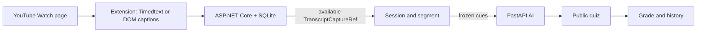

# StudyLens AI architecture

The persistent activation gate is learner-controlled. A valid YouTube caption
capture is the prerequisite for a session; it is not an AI classification
decision.

Extension owns browser and YouTube DOM code. Backend is the persistent system
of record and only it calls FastAPI. FastAPI owns stateless question generation
and short-answer grading. Version 0.4.0 removes all runtime audio/STT capture;
the only new transcript source is `youtubeCaption`.

See [repository map](repository-map.md) and
[spec/source alignment](spec-source-alignment-v1.2.md).
