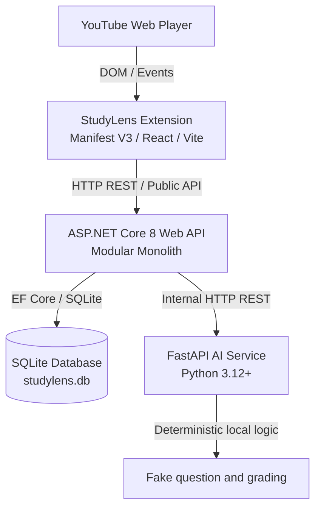

# StudyLens AI — System Architecture

> Xem thêm [Sơ đồ chức năng file và thư mục](repository-map.md) để tra cứu cây repo, entry point và trách nhiệm của từng file.

## 1. Overview

**StudyLens AI** is an active learning companion for YouTube Web. A learner's persistent ON/OFF choice is the activation gate. ON starts a flow for the current YouTube watch page; while ON, a supported SPA video transition closes the old flow and captures the replacement page. Player events, normalized transcript segments, and AI-generated quizzes are processed only while a flow is active.

The current implementation decision is recorded in [v1.2 specification and source alignment](spec-source-alignment-v1.2.md). The controlled transition coordinator observes supported YouTube SPA video-ID changes only while StudyLens is ON. It does not classify videos and never changes the persisted ON/OFF setting by itself.

---

## 2. Physical Architecture

### Architectural Principles

1. **Extension Isolation**:
   - Extension only communicates with the ASP.NET Core Backend.
   - Extension contains no direct AI/LLM API calls, no database connections, and no API keys.
   - YouTube playback is non-blocking: errors in StudyLens never interrupt YouTube video playback.

2. **Backend Authority**:
   - ASP.NET Core Backend owns all application state, sessions, persistence, and AI orchestration.
   - Database operations are restricted entirely to the Backend.

3. **Stateless AI Service**:
   - FastAPI is strictly stateless. It does not store user sessions or database state.
   - The AI service accepts structured payloads and returns validated deterministic fake results in the current baseline; it stores no session or application data and uses no API key.

4. **Independent Vertical Ownership**:
   - The monorepo is divided into 3 vertical business modules (`Dev 1`, `Dev 2`, `Dev 3`).
   - Modules communicate across process boundaries using versioned contracts (`contracts/`).

---

## 3. Vertical Module Slicing

```mermaid
flowchart LR
    subgraph Dev1["Dev 1: Persistent Activation"]
        direction TB
        E1[apps/extension/.../video-activation]
        B1[Extension local activation and learning preferences]
        A1[No classification AI feature]
    end

    subgraph Dev2["Dev 2: Session & Quiz"]
        direction TB
        E2[apps/extension/.../session-quiz]
        B2[services/api/.../Features/SessionQuiz]
        A2[services/ai/.../features/question_generation]
    end

    subgraph Dev3["Dev 3: Assessment & History"]
        direction TB
        E3[apps/extension/.../assessment-history]
        B3[services/api/.../Features/AssessmentHistory]
        A3[services/ai/.../features/grading]
    end

    Dev1 -->|VIDEO_CONTEXT_CHANGED then ACTIVATION_ENABLED + transcript ref| Dev2
    Dev2 -->|QUIZ_AVAILABLE| Dev3
    Dev3 -->|SEEK_REQUEST| Dev1
```

- **Dev 1 (Persistent Activation)**: persistent ON/OFF, local learning preferences, controlled supported-video transitions while ON, PlayerPort, and passive transcript acquisition. There is no video classification.
- **Unsupported-page behavior**: `VIDEO_CONTEXT_UNAVAILABLE` closes only the
  prior page flow when ON navigation leaves `/watch`; global ON waits for a
  later supported capture and is never silently persisted OFF.
- **Dev 2 (Session & Quiz)**: StudySession lifecycle, active watch time tracking, transcript segmentation, and quiz generation orchestration.
- **Dev 3 (Assessment & History)**: Answer submission through the Backend API, MCQ/short-answer grading, timestamp review, and SQLite-backed learning history queries.

---

## 4. Cross-Module Seams

- **Dev 1 → Dev 2**: `ExtensionActivationState`, `VIDEO_CONTEXT_CHANGED`, `ACTIVATION_ENABLED`, `ACTIVATION_DISABLED`, `TranscriptSnapshotRef`, `PreferenceSnapshot`, and normalized player events. The transition identifies the prior activation; the enable envelope carries the replacement YouTube ID only after valid transcript evidence. Dev 2 does not read YouTube DOM or raw transcript sources directly.
- **Dev 2 → Dev 3**: `QUIZ_AVAILABLE` carries `QuestionPublic` to the Extension. The Backend separately reads the server-only `QuestionForAssessment` port to grade an answer; private answer keys and reference answers never cross to the Extension.
- **Dev 3 → Dev 1**: `SEEK_REQUEST` event. Dev 3 dispatches seek requests; only Dev 1's player adapter interacts with the YouTube player.
