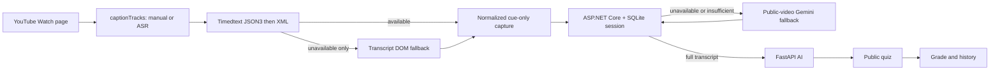

# StudyLens AI architecture

The persistent activation gate is learner-controlled. A valid YouTube watch
page is the prerequisite for a session; transcript validation follows session
creation and is not an AI classification decision.

```mermaid
flowchart LR
  Y[YouTube Watch page] --> T[captionTracks: manual or ASR]
  T --> D[Timedtext JSON3 then XML]
  D -->|unavailable only| R[Transcript DOM fallback]
  D -->|available| E[Normalized cue-only capture]
  R --> E
  E --> B[ASP.NET Core + SQLite session]
  B -->|unavailable or insufficient| F[Public-video Gemini fallback]
  F --> B
  B -->|full transcript| A[FastAPI AI]
  A --> Q[Public quiz]
  Q --> H[Grade and history]
```

Extension owns browser and YouTube DOM code. Backend is the persistent system
of record and only it calls FastAPI. FastAPI owns stateless question generation
and short-answer grading. Version 0.5.0 removes runtime audio/STT capture;
direct `youtubeCaption` is preferred and Gemini is a Backend-requested public
video fallback.

The direct Timedtext route is the primary Full Text acquisition route: it
selects a YouTube manual or ASR track and reads timestamped cues from JSON3,
falling back to XML. DOM observation opens YouTube's “Transcript” panel only
when direct retrieval is unavailable, so it cannot replace or duplicate a
successful direct capture. Backend validates video identity, cue bounds,
canonical content hash and idempotency before storing full-video data. Session
Quiz queues a durable full-video quiz job. FastAPI acquires a transcript only
for the explicit public-video fallback requested by Backend.

See [repository map](repository-map.md) and
[spec/source alignment](spec-source-alignment-v1.2.md).
