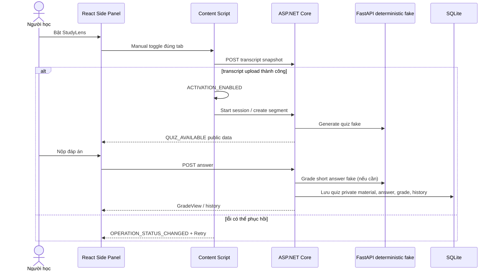
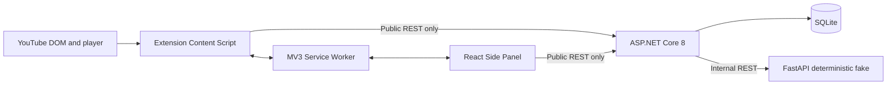

# Sơ đồ chức năng file và thư mục — StudyLens AI

> Cập nhật theo source và contract `0.2.0`. Đây là bản đồ kiến trúc đang chạy;
> không mô tả output sinh tự động như `dist/`, `node_modules/`, `bin/`, `obj/`
> hay cache test.

## 1. Luồng nghiệp vụ hiện tại

StudyLens dùng lựa chọn ON/OFF bền vững của người học làm cổng duy nhất.
Khi ON trên một trang YouTube watch hợp lệ, content script chụp trang đó đúng
một lần, đọc transcript DOM thụ động, và chỉ bắt đầu phiên học sau khi Backend
đã nhận transcript `available`. OFF dừng flow hiện tại; muốn học trang khác,
người dùng chủ động OFF rồi ON lại.



Các lỗi StudyLens không được pause, seek hoặc làm hỏng YouTube player.

## 2. Ranh giới hệ thống



- Extension chỉ gọi ASP.NET Core, không gọi FastAPI, LLM hay database.
- ASP.NET Core sở hữu session, quiz private material, answer attempt, grade và
  history. `ErrorEnvelope` là lỗi công khai duy nhất.
- FastAPI stateless; hiện có question generation và short-answer grading
  deterministic fake, không dùng API key hoặc LLM thật.
- `contracts/` là source of truth cho các biên Extension–Backend,
  Backend–FastAPI và message nội bộ Extension.

## 3. Root và quy tắc

```text
StudylensAI/
├── AGENTS.md                         # Rulebook, scope, contracts, Definition of Done
├── README.md                          # Onboarding, mô tả và lệnh chạy theo repo-relative
├── .agents/rules/
│   ├── common-dev-rules.md            # Quy tắc kỹ thuật chung
│   ├── module-boundary-rules.md       # Ownership và HOT files
│   └── dev/                           # Rule dọc Dev 1 / Dev 2 / Dev 3
├── .codex/agents/                     # Profile Codex tương ứng các role
├── contracts/                         # Source of truth API, schema, fixture
├── apps/extension/                    # Manifest V3 + React/Vite Extension
├── services/api/                      # ASP.NET Core modular monolith
├── services/ai/                       # FastAPI stateless deterministic fake
├── tests/contract/                    # Ajv/OpenAPI contract suites
└── docs/architecture/                 # Kiến trúc, ADR, ownership và bản đồ này
```

Đọc `AGENTS.md`, rule gần nhất, `common-dev-rules.md` và
`module-boundary-rules.md` trước khi sửa source. Bất cứ thay đổi
API/DTO/schema nào phải cập nhật contract, fixture, producer, consumer và test
trong cùng thay đổi.

## 4. Extension — `apps/extension/src/`

```text
shell/
├── App.tsx                            # Side Panel: health, ON/OFF, quiz, grade/history, status card
├── service-worker.ts                  # Persist ON/OFF, relay whitelist, route retry tới tab active
├── content-script.ts                  # Bootstrap Persistent Activation + SessionQuiz runtime
├── sidepanel-main.tsx                 # React entry
└── sidepanel.css                      # Theme light/dark, typography và component style

shared/
├── http/http-client.ts                # fetch timeout + ErrorEnvelope -> HttpError
└── messaging/
    ├── message-bus.ts                 # Local and Chrome runtime publish/subscribe
    ├── message-types.ts               # Envelope 0.2.0
    └── operation-status.ts            # Operation state/code/message/retryable/traceId

platform/youtube/
├── learning-target-capture.ts         # One-time URL/title capture when learner enables
├── youtube-player-adapter.ts          # Only PlayerPort owner of HTMLVideoElement
└── youtube-transcript-adapter.ts      # Passive rendered-transcript DOM reader
```

### Dev 1 — `features/video-activation/`

- `content-script-entry.ts`: coordinator for manual lifecycle, passive
  transcript upload, player event forwarding, and transcript retry.
- `services/activation-manager.ts`: emits one `ACTIVATION_ENABLED` only after
  a valid snapshot; emits `ACTIVATION_DISABLED` on OFF.
- `services/transcript-service.ts`: normalization/hash/idempotency request and
  typed snapshot client.
- `components/ActivationToggle.tsx` / `ActivationStatus.tsx`: pure Side Panel
  presentation.
- `DEV2_HANDOFF_WEEK2.md`: current Dev 1 → Dev 2 seam and retry order.

### Dev 2 — `features/session-quiz/`

- `services/session-quiz-runtime.ts`: consumes activation/player events,
  creates session/segment/quiz and publishes operation statuses.
- `services/session-manager.ts`, `study-timer.ts`, `playback-span-tracker.ts`,
  `segment-manager.ts`: stateful logic with injected clock and idempotency.
- `api/session-quiz-api.ts`: typed Extension → ASP.NET client.
- `models/session-quiz-contracts.ts`: public `QuizPublic`, source reference,
  preferences and transcript/session DTOs.

### Dev 3 — `features/assessment-history/`

- `api/assessment-history-api.ts`: typed answer submit and history load client.
- `components/AssessmentFixturePanel.tsx`: exported `AssessmentPanel` renders
  public questions, preserves a failed draft, submits through Backend and
  reloads persistent history. The old filename is compatibility-only, not a
  fixture runtime path.
- `components/AnswerForm.tsx`, `GradeResult.tsx`, `HistoryPage.tsx`: public
  answer, post-submit feedback and history presentation.
- `state/`: local draft/validation/view state only; no answer key, reference
  answer or rubric may exist before Backend returns a grade.

## 5. Backend — `services/api/src/StudyLens.Api/`

```text
Program.cs                              # module registration, migrations, safe ErrorEnvelope middleware
Infrastructure/Persistence/
├── StudyLensDbContext.cs               # shared EF Core context; module configs auto-discovered
└── Migrations/20260920230000_...cs     # SQLite quiz-private material + answer history

Features/VideoActivation/
├── Api/CreateTranscriptSnapshotEndpoint.cs
├── Application/Contracts/ITranscriptSnapshotReader.cs
└── Infrastructure/InMemoryTranscriptSnapshotStore.cs

Features/SessionQuiz/
├── Api/StudySessionEndpoints.cs, QuizEndpoints.cs
├── Application/QuestionGenerationService.cs
├── Application/Abstractions/IQuestionAssessmentReader.cs
└── Infrastructure/SqliteQuestionAssessmentStore.cs

Features/AssessmentHistory/
├── Api/AssessmentHistoryEndpoints.cs   # answer and history routes
├── Application/AssessmentHistoryService.cs
├── Application/ShortAnswerGradingClient.cs
└── Infrastructure/AssessmentHistoryDbContext.cs
```

| Route | Owner | Purpose |
|---|---|---|
| `POST /api/video-activation/transcript-snapshots` | Dev 1 | Idempotent transcript snapshot upload |
| `POST /api/sessions`, `/complete`, `/segments` | Dev 2 | StudySession lifecycle and transcript-backed segments |
| `POST /api/quizzes/generate`, `GET /api/quizzes/{quizId}` | Dev 2 | Generate/read public quiz; private grading material stays SQLite-only |
| `POST /api/quizzes/{quizId}/answer` | Dev 3 | Idempotent MCQ or short-answer grade |
| `GET /api/history`, `/api/history/videos/{youtubeVideoId}` | Dev 3 | Persistent answer/result history |

`AssessmentHistoryService` grades MCQ with the server-only option key.
Short answers call the deterministic FastAPI route using server-only reference
answer. The extension never receives private quiz material before submit.

## 6. FastAPI — `services/ai/app/`

```text
main.py                                 # router composition
features/question_generation/router.py # deterministic fake question generator
features/grading/router.py              # POST /api/ai/grading/short-answer
features/*/tests/                       # Pydantic/schema behaviour tests
```

The grading request requires `questionId`, `prompt`, `referenceAnswer` and
`answerText`; response is validated `outcome`, `score`, `referenceAnswer` and
`explanation`. A timeout, connection error or invalid response is mapped by
ASP.NET to retryable `gradingUnavailable` without leaking details.

## 7. Contracts and tests

```text
contracts/
├── public-api/
│   ├── video-activation.yaml           # transcript snapshot API
│   ├── session-quiz.yaml               # session, segment, public quiz API
│   └── assessment-history.yaml         # answer, GradeView, history, ErrorEnvelope
├── ai-api/
│   ├── question-generation.yaml        # deterministic fake question generation
│   └── grading.yaml                    # deterministic fake short-answer grading
├── extension-messages/
│   ├── video-activation.schema.json    # activation, player, OPERATION_STATUS_CHANGED
│   ├── session-quiz.schema.json        # QUIZ_AVAILABLE public payload
│   └── assessment-history.schema.json  # answer/history operation-status shape
└── examples/
    └── assessment-history/             # safe public API fixtures only

tests/contract/
├── video-activation/                   # message and transcript API checks
├── session-quiz/                       # public quiz and SessionQuiz contract checks
└── assessment-history/                 # public answer/history and secret-leak checks
```

Contract baseline is `0.2.0`, camelCase, UTC timestamp and integer
milliseconds. `OPERATION_STATUS_CHANGED` supports
`transcriptUpload`, `sessionStart`, `segmentCreate`, `quizGenerate`,
`answerSubmit` and `historyLoad`; the status card can show `code`, `message`,
`traceId` and a Retry control only when `retryable` is true.

## 8. Verification and generated artifacts

Run from the component directory so commands work across developer machines:

```powershell
Set-Location apps/extension
npm.cmd test
npm.cmd run typecheck
npm.cmd run build

Set-Location ../..
dotnet test .\services\api\StudyLens.sln

Set-Location services/ai
py -m pytest app -q
```

`apps/extension/dist/` is rebuilt by `npm.cmd run build`; load that directory
as unpacked Chrome/Edge extension after every source change. Automated tests do
not replace manual browser smoke for upload retry, persistent answer/history,
Backend/FastAPI outage, OFF/ON and non-interference with YouTube playback.
