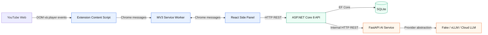
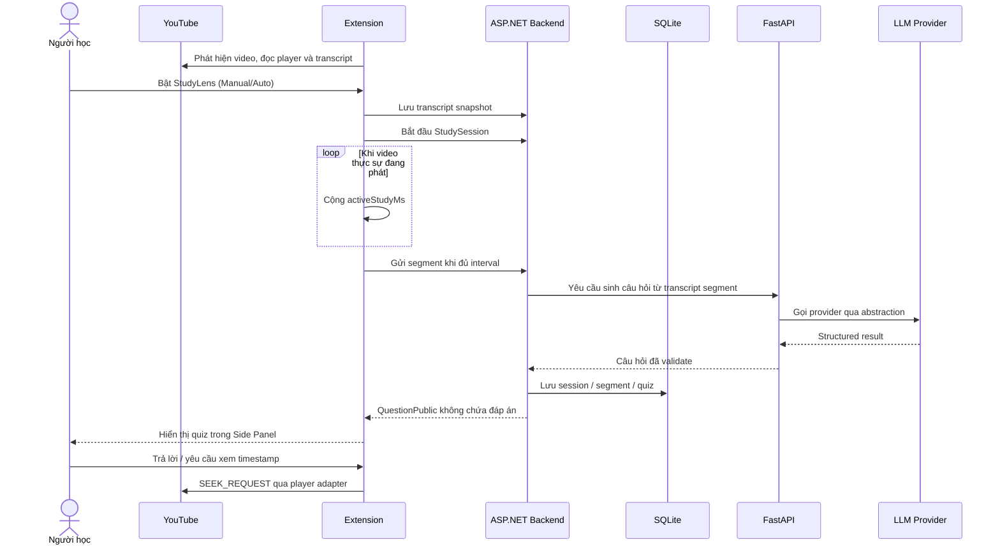
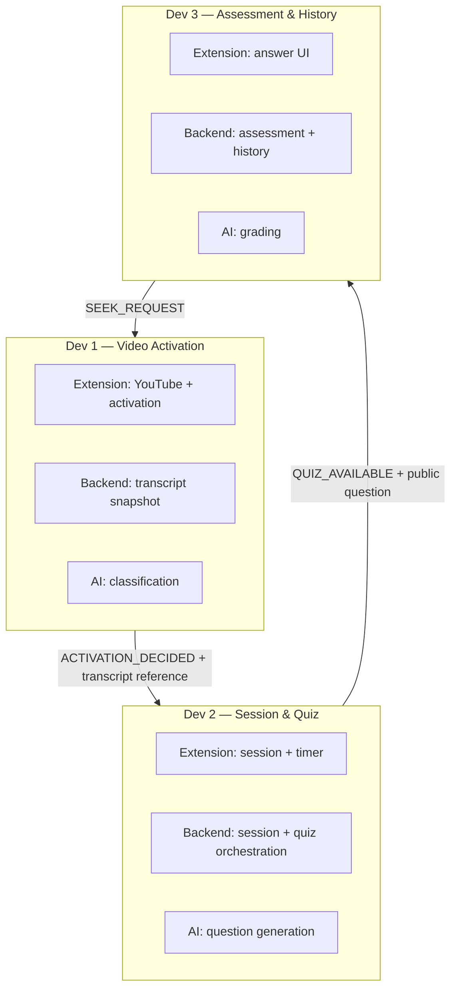
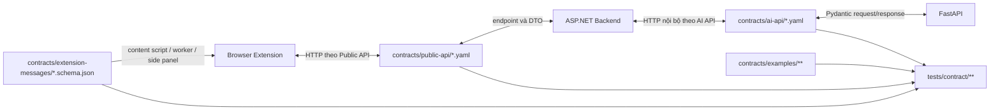

# Sơ đồ chức năng file và thư mục — StudyLens AI

> Cập nhật theo cây thư mục thực tế ngày 2026-09-13. Tài liệu này mô tả vai trò kiến trúc của các file nguồn, cấu hình, contract, fixture và test trong repo; không liệt kê chi tiết nội dung sinh tự động bên trong `node_modules/`, `dist/`, `bin/`, `obj/`, `.venv/` và cache.

## 1. Đọc nhanh kiến trúc

StudyLens AI là một monorepo chia theo **vertical feature**. Mỗi chức năng đi xuyên qua Extension, ASP.NET Core Backend, FastAPI AI Service, contract và test thay vì chia đội thuần frontend/backend.



Các ranh giới bắt buộc:

- Extension chỉ gọi ASP.NET Core Backend, không gọi FastAPI/LLM trực tiếp.
- Backend sở hữu nghiệp vụ, orchestration và dữ liệu ứng dụng.
- FastAPI không lưu session; nó nhận dữ liệu có cấu trúc, gọi lớp LLM và trả kết quả đã validate.
- `contracts/` là source of truth tại biên tích hợp.
- Lỗi Backend/AI không được làm hỏng quá trình phát YouTube.

## 2. Luồng chức năng chính



## 3. Phân chia module dọc



| Module | Trách nhiệm | Vùng code chính |
|---|---|---|
| Dev 1 — Video Activation | Phát hiện YouTube, player events, transcript, Manual/Auto activation | `video-activation/`, `platform/youtube/`, `Features/VideoActivation/`, `features/classification/` |
| Dev 2 — Session & Quiz | Vòng đời session, active watch time, segment, điều phối sinh quiz | `session-quiz/`, `Features/SessionQuiz/`, `features/question_generation/` |
| Dev 3 — Assessment & History | Form trả lời, chấm điểm, giải thích, timestamp review, lịch sử | `assessment-history/`, `Features/AssessmentHistory/`, `features/grading/` |
| Integration Captain | Nối module, entry point, root contract, migration, deploy và file HOT | `shell/`, `Program.cs`, `main.py`, root OpenAPI, persistence/deploy dùng chung |

## 4. Bản đồ contract



Lưu ý hiện trạng:

- `contracts/public-api/root.yaml` và `contracts/ai-api/root.yaml` hiện là root skeleton/health contract; các API nghiệp vụ được mô tả trong file module riêng.
- `classification.yaml`, `grading.yaml` và `assessment-history.yaml` hiện chưa khai báo path nghiệp vụ.
- Public quiz chỉ được phép chứa `QuestionPublic`; đáp án đúng/rubric/reference answer phải ở phía server.

## 5. Cây repo có chú thích

### 5.1. Root, quy tắc và tài liệu điều phối

```text
StudylensAI/
├── AGENTS.md
│   └── Rulebook cấp repo: scope MVP, kiến trúc, contract, bảo mật, test và Definition of Done.
├── README.md
│   └── Điểm bắt đầu cho người mới: tổng quan, cấu trúc, lệnh chạy và health endpoints.
├── .editorconfig
│   └── Chuẩn UTF-8/LF/indent; C# và Python dùng 4 spaces, mặc định dùng 2.
├── .env.example
│   └── Mẫu biến môi trường an toàn cho Backend, SQLite, AI Service và LLM provider.
├── .gitignore
│   └── Loại dependency, build output, secret, database, cache Python/.NET và file IDE khỏi Git.
├── package-lock.json
│   └── Lockfile npm rỗng ở root; chưa khai báo root package/workspace.
├── ke_hoach_6_tuan.md
│   └── Kế hoạch 6 tuần, chia việc ba developer và mốc tích hợp theo tuần.
├── quang-rule.md
│   └── Ghi chú role Dev 3 và mẫu Personal Codex Defaults cục bộ.
├── Huong_dan_du_an_StudyLens_AI.docx
│   └── Tài liệu Word hướng dẫn dự án dùng chung cho nhóm.
└── ~$ong_dan_du_an_StudyLens_AI.docx
    └── File khóa tạm do Microsoft Word tạo; không phải tài liệu nguồn của hệ thống.
```

```text
.agents/
├── README.md
│   └── Mục lục workspace hướng dẫn Codex và thứ tự đọc rule.
├── rules/
│   ├── common-dev-rules.md
│   │   └── Checklist chung: system boundary, contract baseline, HOT files và pre-PR checks.
│   ├── api-contract-rules.md
│   │   └── Quy tắc đồng bộ OpenAPI/schema, DTO, fixture, client và test khi contract đổi.
│   ├── module-boundary-rules.md
│   │   └── Danh sách path sở hữu của Dev 1/2/3 và các contract giao tiếp liên module.
│   └── dev/
│       ├── README.md
│       │   └── Ánh xạ từng developer sang role rule và custom agent tương ứng.
│       ├── dev1-video-activation.md
│       │   └── Backlog, acceptance criteria và kiến trúc chi tiết cho Video Activation.
│       ├── dev2-session-quiz.md
│       │   └── Backlog B01–B10 và thiết kế chi tiết cho Study Session & Quiz Generation.
│       └── dev3-assessment-history.md
│           └── Backlog và thiết kế chi tiết cho Assessment, Grading & History.
├── playbooks/
│   ├── vertical-feature-workflow.md
│   │   └── Quy trình contract-first để triển khai một lát cắt dọc và xác minh Definition of Done.
│   └── integration-captain-workflow.md
│       └── Quy trình chỉnh HOT files, nối module và chạy bộ kiểm tra tích hợp đầy đủ.
└── skills/
    ├── studylens-contract-first/SKILL.md
    │   └── Hướng dẫn Codex khi thay API/DTO/message schema hoặc biên tích hợp.
    ├── studylens-vertical-feature/SKILL.md
    │   └── Hướng dẫn Codex triển khai feature dọc thuộc Dev 1, 2 hoặc 3.
    └── studylens-integration-captain/SKILL.md
        └── Hướng dẫn Codex xử lý module wiring, migration, root contract và HOT files.
```

```text
.codex/agents/
├── dev1-video-activation.toml
│   └── Custom agent profile giới hạn quyền sở hữu và trách nhiệm Dev 1.
├── dev2-session-quiz.toml
│   └── Custom agent profile giới hạn quyền sở hữu và trách nhiệm Dev 2.
├── dev3-assessment-history.toml
│   └── Custom agent profile giới hạn quyền sở hữu và trách nhiệm Dev 3.
└── integration-captain.toml
    └── Custom agent profile dành cho chỉnh sửa tích hợp và file dùng chung.
```

### 5.2. Browser Extension — `apps/extension/`

```text
apps/extension/
├── AGENTS.md
│   └── Rule cục bộ: cô lập YouTube DOM, chỉ gọi Backend, tuân thủ message contract và build TypeScript.
├── manifest.json
│   └── Manifest V3: quyền sidePanel/storage/tabs, host YouTube/Backend, service worker và content script.
├── package.json
│   └── Metadata, dependency React và scripts dev/build/typecheck/test của Extension.
├── package-lock.json
│   └── Khóa chính xác dependency npm của riêng Extension.
├── sidepanel.html
│   └── HTML entry chứa root DOM và nạp bundle React cho Side Panel.
├── tsconfig.json
│   └── TypeScript strict config cho ES2022, DOM và JSX React.
├── vite.config.ts
│   └── Build ba entry: side panel, service worker, content script; copy manifest vào `dist/`.
└── vitest.config.ts
    └── Chạy unit test Extension và contract test Video Activation trong môi trường Node.
```

#### Shell và shared boundary

```text
apps/extension/src/
├── shell/                                      # Entry point và wiring dùng chung — HOT
│   ├── App.tsx
│   │   └── UI Side Panel tổng: health, trạng thái video/activation, session và quiz/answer seed.
│   ├── app-store.ts
│   │   └── Kiểu `AppState` và state ban đầu của shell.
│   ├── content-script.ts
│   │   └── Bootstrap content script, khởi tạo Video Activation và báo video context cho worker.
│   ├── feature-registry.ts
│   │   └── Đăng ký metadata/public surface của ba feature vào shell.
│   ├── service-worker.ts
│   │   └── Relay message giữa content script và Side Panel; lưu context theo tab và chuyển Manual toggle.
│   └── sidepanel-main.tsx
│       └── React DOM entry, mount `<App />` vào `sidepanel.html`.
├── shared/                                     # Hạ tầng Extension dùng chung — HOT
│   ├── config/
│   │   └── extension-config.ts
│   │       └── Đọc `VITE_BACKEND_URL`, mặc định `http://localhost:5000`.
│   ├── http/
│   │   ├── http-client.ts
│   │   │   └── Wrapper `fetch` dùng chung: base URL, JSON, timeout, correlation và error mapping.
│   │   └── http-error.ts
│   │       └── `ErrorEnvelope` và exception `HttpError` chuẩn hóa lỗi Backend.
│   └── messaging/
│       ├── message-bus.ts
│       │   └── Abstraction publish/subscribe trên Chrome runtime messaging.
│       └── message-types.ts
│           └── Kiểu message và handler dùng chung trong Extension.
└── generated/
    └── .gitkeep
        └── Giữ chỗ cho client/type sinh tự động từ contracts; hiện chưa có generated code.
```

#### Dev 1 — YouTube platform và Video Activation

```text
apps/extension/src/platform/youtube/
├── .gitkeep
│   └── File giữ thư mục trong Git; vẫn còn dù thư mục đã có source.
├── youtube-types.ts
│   └── Kiểu video context/playback/environment và hàm đổi giây sang millisecond.
├── youtube-detector.ts
│   └── Parse URL `/watch`, tìm video hợp lệ, đọc metadata/state và theo dõi SPA navigation/video change.
├── youtube-events.ts
│   └── Kiểu player event chuẩn hóa và factory tạo message envelope contract `0.1.0`.
├── youtube-player-adapter.ts
│   └── `PlayerPort` và adapter play/pause/seek an toàn trên phần tử video YouTube.
├── transcript-reader.ts
│   └── Đọc cue từ DOM, parse timestamp, chuẩn hóa text/language và phân loại transcript đủ/thiếu.
├── youtube-transcript-adapter.ts
│   └── Poll transcript source, chống phát lặp bằng fingerprint và phát snapshot result cho feature.
└── __tests__/
    ├── youtube-detector.spec.ts
    │   └── Test URL, video hợp lệ/không hợp lệ, metadata và phát hiện thay đổi video.
    ├── youtube-player-adapter.spec.ts
    │   └── Test play/pause/seek, clamp timestamp và lỗi khi thiếu player.
    ├── transcript-reader.spec.ts
    │   └── Test normalize cue, timestamp, transcript insufficient và request identity.
    └── youtube-transcript-adapter.spec.ts
        └── Test polling/fingerprint và callback của DOM transcript adapter.
```

```text
apps/extension/src/features/video-activation/
├── index.ts
│   └── Public surface và metadata đăng ký feature Video Activation.
├── content-script-entry.ts
│   └── Điều phối detector, player, transcript, Manual ON/OFF và message listener trong content script.
├── DEV2_HANDOFF_WEEK2.md
│   └── Ghi chú handoff đầu vào tuần 2 từ Dev 1 sang Dev 2.
├── api/
│   └── video-activation-api.ts
│       └── Typed client POST transcript snapshot lên Backend và chuẩn hóa lỗi HTTP.
├── models/
│   ├── activation.types.ts
│   │   └── Contract nội bộ cho context, preference, activation decision/stopped và activation state.
│   └── video-activation.types.ts
│       └── DTO transcript cue, create-snapshot request và `TranscriptSnapshotRef`.
├── services/
│   ├── activation-manager.ts
│   │   └── State machine Manual activation; tạo decision idempotent và xử lý OFF/video change.
│   └── transcript-service.ts
│       └── Chuyển transcript đọc được thành request, tạo content hash và gọi API snapshot.
├── state/
│   ├── activation-reducer.ts
│   │   └── Pure reducer cho trạng thái inactive/activating/active/error.
│   └── side-panel-activation.ts
│       └── Áp message từ worker vào state hiển thị của Side Panel.
├── components/
│   ├── ActivationStatus.tsx
│   │   └── Hiển thị trạng thái kích hoạt hiện tại.
│   └── ActivationToggle.tsx
│       └── Nút bật/tắt thủ công, chỉ phát callback UI.
└── __tests__/
    ├── activation-manager.spec.ts
    │   └── Test reducer và Manual activation lifecycle/idempotency.
    └── side-panel-activation.spec.ts
        └── Test ánh xạ message Video Activation sang state Side Panel.
```

#### Dev 2 — Session & Quiz

```text
apps/extension/src/features/session-quiz/
├── index.ts
│   └── Public surface/metadata của feature; export manager, timer, contract types và API client.
├── api/
│   └── session-quiz-api.ts
│       └── Typed HTTP client để generate/get quiz qua shared `HttpClient`.
├── models/
│   └── session-quiz-contracts.ts
│       └── TypeScript DTO cho preference, activation fixture, session, transcript cue và public quiz.
├── services/
│   ├── session-manager.ts
│   │   └── Điều phối start/complete session từ activation; dùng `decisionId` và `clientCompletionId` idempotent.
│   └── study-timer.ts
│       └── Tính `activeStudyMs` bằng injected clock; không cộng pause/buffer/seek và hỗ trợ restore snapshot.
├── state/
│   ├── session-types.ts
│   │   └── Kiểu state/action và port start/complete session.
│   └── session-reducer.ts
│       └── Pure reducer cho idle/starting/active/completing/completed/error.
└── __tests__/
    ├── session-manager.spec.ts
    │   └── Test start/complete lifecycle và duplicate activation/completion.
    └── study-timer.spec.ts
        └── Test fake clock cho play/pause/buffering/seek, restore và clock out-of-order.
```

#### Dev 3 — Assessment & History

```text
apps/extension/src/features/assessment-history/
├── index.ts
│   └── Public surface/metadata và exports cho UI, reducer, types và seed fixture.
├── types/
│   └── assessment-types.ts
│       └── `QuestionPublic`, `QuizAvailable`, source ref và kiểu answer draft/submission cục bộ.
├── state/
│   └── assessment-reducer.ts
│       └── Quản lý draft/validation/submitting state và tạo local answer submission.
├── components/
│   ├── AnswerForm.tsx
│   │   └── Chọn renderer theo loại câu hỏi, validate và gọi callback submit.
│   ├── MultipleChoiceAnswer.tsx
│   │   └── Radio options cho câu hỏi multiple choice.
│   └── ShortAnswerInput.tsx
│       └── Textarea/input điều khiển cho câu trả lời ngắn.
├── __fixtures__/
│   └── seed-quiz.ts
│       └── Quiz public cố định để phát triển UI độc lập khi Backend chưa hoàn chỉnh.
└── __tests__/
    ├── answer-form.spec.ts
    │   └── Smoke test source/component và bảo đảm UI không lộ đáp án.
    └── assessment-reducer.spec.ts
        └── Test draft, validation và local submission từ seed questions.
```

### 5.3. ASP.NET Core Backend — `services/api/`

```text
services/api/
├── AGENTS.md
│   └── Rule Backend: endpoint mỏng, logic trong feature, Backend sở hữu persistence, test theo module.
├── StudyLens.sln
│   └── Solution chứa API project và ba xUnit module test projects.
├── src/StudyLens.Api/
│   ├── StudyLens.Api.csproj
│   │   └── ASP.NET Core `net8.0`; tham chiếu EF Core SQLite/Design và Swagger.
│   ├── Program.cs
│   │   └── Composition root: CORS, SQLite DbContext, AI health client, module DI/routes, Swagger và run app.
│   ├── appsettings.json
│   │   └── Logging, SQLite `DefaultConnection` và `AiService.BaseUrl` mặc định.
│   ├── appsettings.Development.json
│   │   └── Mức logging chi tiết cho môi trường Development.
│   ├── Properties/
│   │   └── launchSettings.json
│   │       └── Profile chạy HTTP tại `http://localhost:5000`.
│   ├── BuildingBlocks/                         # Hạ tầng chia sẻ — HOT
│   │   ├── Errors/
│   │   │   └── ErrorEnvelope.cs
│   │   │       └── Response lỗi chuẩn gồm code, message và correlation id.
│   │   ├── Health/
│   │   │   └── HealthEndpoint.cs
│   │   │       └── `GET /api/health` và proxy `GET /api/health/ai`.
│   │   └── Http/
│   │       └── AiHealthClient.cs
│   │           └── Typed HttpClient gọi `GET /health` của FastAPI và trả trạng thái an toàn.
│   ├── Infrastructure/Persistence/             # Persistence dùng chung — HOT
│   │   ├── StudyLensDbContext.cs
│   │   │   └── EF Core DbContext; quét entity configuration từ assembly.
│   │   └── Migrations/
│   │       └── .gitkeep
│   │           └── Giữ chỗ cho EF migrations; hiện chưa có migration source.
│   └── Features/                               # Ba vertical backend modules
│       ├── VideoActivation/                    # Chi tiết bên dưới
│       ├── SessionQuiz/                        # Chi tiết bên dưới
│       └── AssessmentHistory/                  # Chi tiết bên dưới
└── tests/
    ├── VideoActivation.Tests/
    ├── SessionQuiz.Tests/
    └── AssessmentHistory.Tests/
```

#### Backend Dev 1 — Video Activation

```text
services/api/src/StudyLens.Api/Features/VideoActivation/
├── VideoActivationModule.cs
│   └── Đăng ký store/handler/reader và map endpoint transcript snapshot.
├── AssemblyInfo.cs
│   └── Cho phép test project truy cập internal types bằng `InternalsVisibleTo`.
├── Api/
│   └── CreateTranscriptSnapshotEndpoint.cs
│       └── Nhận POST snapshot, map request sang command, gọi handler và map outcome sang HTTP.
├── Application/
│   ├── Contracts/
│   │   ├── ITranscriptSnapshotReader.cs
│   │   │   └── Published port để Dev 2 đọc snapshot mà không truy cập store nội bộ Dev 1.
│   │   └── TranscriptSnapshotForSession.cs
│   │       └── Published read model snapshot/cues phục vụ tạo StudySession và segment.
│   └── CreateTranscriptSnapshot/
│       ├── CreateTranscriptSnapshotCommand.cs
│       │   └── Command nội bộ và cue input cho use case tạo snapshot.
│       ├── CreateTranscriptSnapshotValidator.cs
│       │   └── Validate version, YouTube id, trạng thái, cue range/content/hash và request identity.
│       ├── CreateTranscriptSnapshotHandler.cs
│       │   └── Áp validation, dựng domain snapshot và lưu theo semantics idempotent/conflict.
│       └── CreateTranscriptSnapshotResult.cs
│           └── Outcome enum và result model cho created/replayed/invalid/conflict.
├── Domain/
│   ├── TranscriptCue.cs
│   │   └── Domain record cho một cue có start/end/text.
│   ├── TranscriptSnapshot.cs
│   │   └── Domain record cho snapshot transcript gắn video, language, hash và cues.
│   └── TranscriptSnapshotStatus.cs
│       └── Enum `Available`, `Unavailable`, `Insufficient`.
└── Infrastructure/
    ├── ITranscriptSnapshotStore.cs
    │   └── Port lưu snapshot và result cho biết bản ghi mới hay replay.
    ├── InMemoryTranscriptSnapshotStore.cs
    │   └── Store thread-safe trong RAM, hỗ trợ idempotency theo client request id.
    └── TranscriptSnapshotReader.cs
        └── Adapter từ store nội bộ sang published `ITranscriptSnapshotReader`.
```

#### Backend Dev 2 — Session & Quiz

```text
services/api/src/StudyLens.Api/Features/SessionQuiz/
├── SessionQuizModule.cs
│   └── Đăng ký service/gateway và map start, complete, generate quiz, get quiz endpoints.
├── Api/
│   ├── StudySessionEndpoints.cs
│   │   └── Map HTTP request/response cho start và complete session, giữ endpoint mỏng.
│   └── QuizEndpoints.cs
│       └── Map request generate/get quiz sang `QuestionGenerationService` và error response.
├── Application/
│   ├── StudySessionService.cs
│   │   └── In-memory session lifecycle; idempotent theo decision/completion id và validate transition.
│   ├── QuestionGenerationClient.cs
│   │   └── Gateway/typed HttpClient gọi FastAPI question-generation contract.
│   └── QuestionGenerationService.cs
│       └── Validate command/cues, chống duplicate bằng idempotency key, gọi AI và tạo public quiz không lộ đáp án.
└── Domain/
    └── StudySession.cs
        └── Domain record tối thiểu cho session id, video, status, active time và timestamps.
```

#### Backend Dev 3 — Assessment & History

```text
services/api/src/StudyLens.Api/Features/AssessmentHistory/
└── AssessmentHistoryModule.cs
    └── Skeleton DI/route module; answer, grading và history endpoints chưa được triển khai trong file này.
```

#### Backend tests

```text
services/api/tests/
├── VideoActivation.Tests/
│   ├── VideoActivation.Tests.csproj
│   │   └── xUnit project tham chiếu API project và ASP.NET test host.
│   └── VideoActivationModuleTests.cs
│       └── Test module registration, endpoint, validation, idempotent replay/conflict và reader contract.
├── SessionQuiz.Tests/
│   ├── SessionQuiz.Tests.csproj
│   │   └── xUnit project cho Dev 2, tham chiếu API project và test host.
│   └── SessionQuizModuleTests.cs
│       └── Test session start/complete, duplicate semantics và quiz generation/get behavior.
└── AssessmentHistory.Tests/
    ├── AssessmentHistory.Tests.csproj
    │   └── xUnit project cho Dev 3, tham chiếu API project và test host.
    └── AssessmentHistoryModuleTests.cs
        └── Skeleton test bảo đảm module đăng ký/map được mà không lỗi.
```

### 5.4. FastAPI AI Service — `services/ai/`

```text
services/ai/
├── AGENTS.md
│   └── Rule AI: router mỏng, stateless, Pydantic validation và provider abstraction.
├── pyproject.toml
│   └── Python package metadata, yêu cầu Python 3.12+ và dependency runtime.
├── requirements.txt
│   └── Danh sách dependency cài nhanh cho FastAPI/Uvicorn/Pydantic/httpx/pytest.
└── app/
    ├── __init__.py
    │   └── Đánh dấu `app` là Python package.
    ├── main.py
    │   └── FastAPI composition root: CORS, health và ba feature routers; chạy Uvicorn khi gọi trực tiếp.
    ├── platform/                               # Hạ tầng AI dùng chung — HOT
    │   ├── __init__.py
    │   │   └── Đánh dấu package platform.
    │   ├── config.py
    │   │   └── Pydantic settings tối thiểu cho tên và version ứng dụng.
    │   ├── health.py
    │   │   └── `GET /health` trả status/service/version.
    │   └── llm/
    │       ├── __init__.py
    │       │   └── Export `LlmProvider` và `FakeLlmProvider`.
    │       ├── provider.py
    │       │   └── Python `Protocol` trung lập nhà cung cấp cho thao tác generate.
    │       └── fake_provider.py
    │           └── Provider xác định dùng cho skeleton/test, không gọi mạng.
    └── features/
        ├── __init__.py
        │   └── Đánh dấu package chứa vertical AI features.
        ├── classification/
        │   ├── __init__.py
        │   │   └── Export router Dev 1.
        │   └── router.py
        │       └── Router prefix `/api/ai/classification`; hiện là placeholder chưa có endpoint.
        ├── question_generation/
        │   ├── __init__.py
        │   │   └── Export router Dev 2.
        │   ├── router.py
        │   │   └── Pydantic schemas, validation và POST `/generate`; hiện trả deterministic fake question.
        │   └── tests/
        │       └── test_contract_skeleton.py
        │           └── Test router prefix và fake MCQ phù hợp contract cơ bản.
        └── grading/
            ├── __init__.py
            │   └── Export router Dev 3.
            └── router.py
                └── Router prefix `/api/ai/grading`; hiện là placeholder chưa có endpoint.
```

### 5.5. Contracts và fixtures — `contracts/`

```text
contracts/
├── AGENTS.md
│   └── Rule contract: version 0.1.0, camelCase, millisecond, UTC và không lộ dữ liệu chấm điểm.
├── public-api/                                # Extension ↔ Backend
│   ├── root.yaml
│   │   └── Root OpenAPI hiện mô tả `GET /api/health`.
│   ├── video-activation.yaml
│   │   └── POST transcript snapshot và schemas/errors của Video Activation.
│   ├── session-quiz.yaml
│   │   └── Start/complete session, create segment, generate/get quiz và DTO/errors Dev 2.
│   └── assessment-history.yaml
│       └── OpenAPI placeholder Dev 3; hiện `paths: {}`.
├── ai-api/                                    # Backend ↔ FastAPI
│   ├── root.yaml
│   │   └── Root OpenAPI nội bộ hiện mô tả `GET /health`.
│   ├── classification.yaml
│   │   └── OpenAPI placeholder cho classification; hiện `paths: {}`.
│   ├── question-generation.yaml
│   │   └── POST question generation, transcript cues và structured question schemas.
│   └── grading.yaml
│       └── OpenAPI placeholder cho grading; hiện `paths: {}`.
├── extension-messages/                       # Message nội bộ browser
│   ├── video-activation.schema.json
│   │   └── Envelope/schema cho manual activation, decision/stopped, context và player events.
│   ├── session-quiz.schema.json
│   │   └── Envelope `QUIZ_AVAILABLE` và public quiz/question/source payload.
│   └── assessment-history.schema.json
│       └── Envelope cơ sở cho message Answer/Review/History của Dev 3.
└── examples/                                  # Dữ liệu mẫu dùng chung cho dev/test
    ├── video-activation/
    │   ├── .gitkeep
    │   │   └── Giữ thư mục fixture trong Git.
    │   ├── video-valid.json
    │   │   └── Video context YouTube hợp lệ.
    │   ├── video-unsupported.json
    │   │   └── Ví dụ URL/video không được hỗ trợ.
    │   ├── player-playing.json
    │   │   └── Message player đang phát.
    │   ├── player-buffering.json
    │   │   └── Message player buffering.
    │   ├── player-seeked.json
    │   │   └── Message player vừa seek.
    │   ├── transcript-valid-en.request.json
    │   │   └── Request transcript tiếng Anh có cues hợp lệ.
    │   ├── transcript-valid-vi.request.json
    │   │   └── Request transcript tiếng Việt có cues hợp lệ.
    │   ├── transcript-valid.response.json
    │   │   └── Response `TranscriptSnapshotRef` thành công.
    │   ├── transcript-unavailable.request.json
    │   │   └── Request biểu diễn transcript không tồn tại.
    │   ├── transcript-insufficient.request.json
    │   │   └── Request biểu diễn transcript không đủ nội dung.
    │   ├── transcript-idempotency-conflict.request.json
    │   │   └── Payload dùng test cùng request id nhưng khác semantic content.
    │   ├── manual-on.json
    │   │   └── Fixture người dùng bật StudyLens thủ công.
    │   ├── manual-off.json
    │   │   └── Fixture người dùng tắt StudyLens thủ công.
    │   ├── manual-video-changed.json
    │   │   └── Fixture dừng activation do đổi video.
    │   └── manual-no-transcript.json
    │       └── Fixture Manual ON khi transcript chưa khả dụng.
    ├── session-quiz/
    │   ├── .gitkeep
    │   │   └── Giữ thư mục fixture trong Git.
    │   ├── start-session-active.request.json
    │   │   └── Request bắt đầu session từ active decision.
    │   ├── session-active.response.json
    │   │   └── Response snapshot của session đang active.
    │   ├── question-generation.request.json
    │   │   └── Request Backend gửi FastAPI theo AI contract.
    │   ├── generate-quiz.request.json
    │   │   └── Request Extension/consumer yêu cầu Backend sinh quiz.
    │   └── quiz-available.message.json
    │       └── Message `QUIZ_AVAILABLE` public cho Extension/Dev 3.
    └── assessment-history/
        ├── .gitkeep
        │   └── Giữ thư mục fixture trong Git.
        └── quiz-available.public.json
            └── Public quiz seed để Dev 3 phát triển Answer UI không cần đọc internals Dev 2.
```

### 5.6. Contract và E2E tests — `tests/`

```text
tests/
├── contract/
│   ├── video-activation/
│   │   ├── .gitkeep
│   │   │   └── Giữ thư mục test trong Git.
│   │   ├── public-api.contract.spec.ts
│   │   │   └── Parse OpenAPI/fixtures, kiểm tra endpoint snapshot, schema và error cases.
│   │   └── extension-messages.contract.spec.ts
│   │       └── Validate fixtures player/manual activation theo JSON Schema.
│   ├── session-quiz/
│   │   ├── .gitkeep
│   │   │   └── Giữ thư mục test trong Git.
│   │   ├── vitest.config.mjs
│   │   │   └── Vitest config độc lập để chạy contract suite Dev 2 từ repo root.
│   │   └── session-quiz-contract.spec.ts
│   │       └── Kiểm tra version/path/schema/fixture và bảo đảm public question không lộ đáp án.
│   └── assessment-history/
│       └── .gitkeep
│           └── Placeholder; chưa có contract test source Dev 3.
└── e2e/
    ├── video-activation/.gitkeep
    │   └── Placeholder cho E2E Video Activation.
    ├── session-quiz/.gitkeep
    │   └── Placeholder cho E2E Session & Quiz.
    └── assessment-history/.gitkeep
        └── Placeholder cho E2E Assessment & History.
```

### 5.7. Tài liệu, automation và deploy

```text
docs/
└── architecture/
    ├── README.md
    │   └── Kiến trúc vật lý, nguyên tắc hệ thống, vertical slicing và cross-module seams.
    ├── module-ownership.md
    │   └── Ma trận path sở hữu Dev 1/2/3 và danh sách file HOT của Integration Captain.
    └── repository-map.md
        └── Tài liệu hiện tại: sơ đồ kiến trúc và chức năng từng file/folder trong repo.
```

```text
scripts/
└── README.md
    └── Placeholder cho code generation, schema validation, setup, verification và data seeding scripts.

deploy/
└── README.md
    └── Placeholder cho Docker/container/cloud manifests; production deployment chưa nằm trong skeleton hiện tại.
```

## 6. Entry points và đường đi khi debug

| Khi cần tìm | Bắt đầu từ | Đi tiếp tới |
|---|---|---|
| Side Panel không hiển thị đúng | `apps/extension/src/shell/App.tsx` | feature component → reducer/types |
| Content script không nhận video | `apps/extension/src/shell/content-script.ts` | `video-activation/content-script-entry.ts` → `platform/youtube/` |
| Message không tới Side Panel | `apps/extension/src/shell/service-worker.ts` | `shared/messaging/` → message schema |
| Extension gọi API lỗi | Feature `api/*.ts` | `shared/http/http-client.ts` → public OpenAPI |
| Backend route không tồn tại | `services/api/.../Program.cs` | `*Module.cs` → `Api/*Endpoints.cs` |
| Sai nghiệp vụ session/quiz | `Features/SessionQuiz/Application/` | Domain → test project → contract fixtures |
| Backend không gọi được AI | `QuestionGenerationClient.cs` hoặc `AiHealthClient.cs` | `appsettings.json` → AI router → AI OpenAPI |
| FastAPI route/schema lỗi | `services/ai/app/main.py` | feature `router.py` → AI contract/test |
| DTO lệch giữa các lớp | `contracts/` | example fixture → TypeScript DTO → C# record → Pydantic model |
| Sai owner hoặc đụng file HOT | `docs/architecture/module-ownership.md` | `.agents/rules/module-boundary-rules.md` |

## 7. Thư mục/file sinh tự động không mô tả từng phần tử

Những mục sau có thể xuất hiện trong checkout nhưng không phải source of truth và không nên được chỉnh tay:

| Path/pattern | Nguồn tạo | Cách tái tạo hoặc xử lý |
|---|---|---|
| `.git/` | Git | Clone/init repository |
| `apps/extension/node_modules/` | npm | `npm.cmd install` trong `apps/extension` |
| `apps/extension/dist/` | Vite | `npm.cmd run build` |
| `**/bin/`, `**/obj/` | .NET SDK | `dotnet build`/`dotnet test` |
| `services/ai/.venv/` | Python venv | Tạo venv và cài `requirements.txt` |
| `**/__pycache__/`, `.pytest_cache/` | Python/pytest | Tự sinh khi import/chạy test; có thể xóa an toàn khi process đã dừng |
| `tests/contract/**/.vite/` | Vitest/Vite | Tự sinh khi chạy contract tests |
| `coverage/`, `TestResults/` | Test runners | Tự sinh khi bật coverage/test reporting |
| `*.db`, `*.db-shm`, `*.db-wal` | EF Core/SQLite | Dữ liệu runtime cục bộ; đã được `.gitignore` loại trừ |

## 8. Quy ước cập nhật tài liệu này

Khi thêm, đổi tên hoặc xóa file nguồn:

1. Cập nhật đúng nhánh cây trong mục 5.
2. Nếu thay đổi luồng gọi giữa process, cập nhật sơ đồ mục 1–4.
3. Nếu thay đổi ownership/HOT file, cập nhật cả `module-ownership.md` và rule liên quan.
4. Nếu thay contract, cập nhật OpenAPI/schema, DTO, fixture và contract test trong cùng thay đổi.
5. Mô tả chức năng **đang có**, đồng thời ghi rõ `placeholder`/`skeleton` cho phần chưa triển khai.
